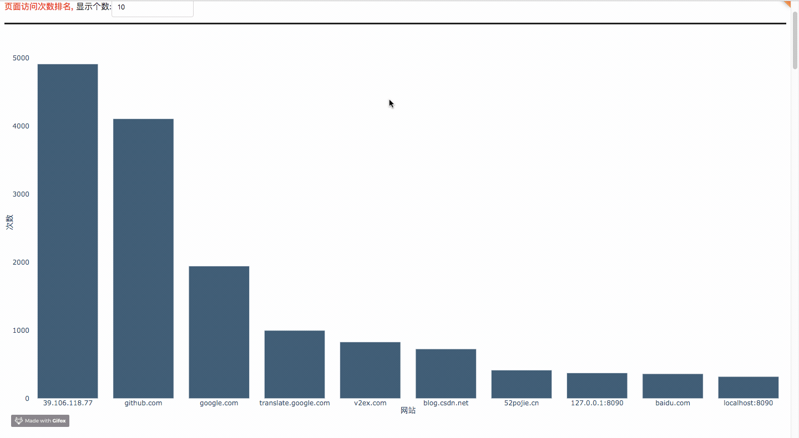
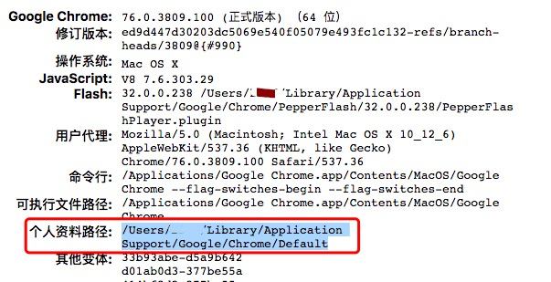
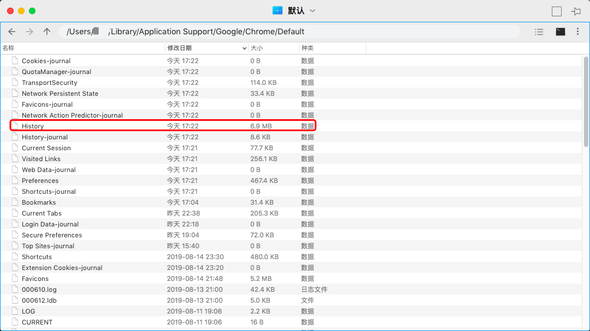

## 一键分析你的上网行为, 看看你平时上网都在干嘛?
## Chrome浏览器历史记录文件可视化


### 简介

**想看看你最近一年都在干嘛？看看你平时上网是在摸鱼还是认真工作？想写年度汇报总结，但是苦于没有数据？现在，它来了。**

这是一个能让你了解自己的浏览历史的Chrome浏览历史记录分析程序，**他适用于Chrome浏览器或者以Chromium为内核的浏览器。目前国内大部分浏览器均是以Chromium为内核的浏览器，所以基本上都可以使用。但是不支持以下浏览器：IE浏览器、Firefox浏览器、Safari浏览器。**

在该页面中你将可以查看有关自己在过去的时间里所访问浏览的域名、URL以及忙碌天数的前十排名以及相关的数据图表。

<br />
<br />

### 部分截图


<br />
<br />

### 代码思路

#### 1. 目录结构
首先，我们先看一下整体目录结构

```bash
Code
├─ app_callback.py                          回调函数，实现后台功能
├─ app_configuration.py                     web服务器配置
├─ app_layout.py                            web前端页面配置
├─ app_plot.py                              web图表绘制
├─ app.py                                   web服务器的启动
├─ assets                                   web所需的一些静态资源文件
│  ├─ css                                   web前端元素布局文件
│  │  ├─ custum-styles_phyloapp.css
│  │  └─ stylesheet.css
│  ├─ image                                 web前端logo图标
│  │  ├─ GitHub-Mark-Light.png
│  └─ static                                web前端帮助页面
│  │  ├─ help.html
│  │  └─ help.md
├─ history_data.py                          解析chrome历史记录文件
└─ requirement.txt                          程序所需依赖库
```
- app_callback.py
该程序基于python，使用dash web轻量级框架进行部署。`app_callback.py`主要用于回调，可以理解为实现后台功能。

- app_configuration.py
顾名思义，对web服务器的一些配置操作。

- app_layout..py
web前端页面配置，包含html, css元素。

- app_plot.py
这个主要是为实现一些web前端的图表数据。

- app.py
web服务器的启动。

- assets
静态资源目录，用于存储一些我们所需要的静态资源数据。

- history_data.py
通过连接sqlite数据库，并解析Chrome历史记录文件。

- requirement.txt
运行本程序所需要的依赖库。

<br />

#### 2. 解析历史记录文件数据
与解析历史记录文件数据有关的文件为`history_data.py`文件。我们一一分析。

```python
# 查询数据库内容
def query_sqlite_db(history_db, query):

    # 查询sqlite数据库
    # 注意，History是一个文件，没有后缀名。它不是一个目录。
    conn = sqlite3.connect(history_db)
    cursor = conn.cursor()

    # 使用sqlite查看软件，可清晰看到表visits的字段url=表urls的字段id
    # 连接表urls和visits，并获取指定数据
    select_statement = query

    # 执行数据库查询语句
    cursor.execute(select_statement)

    # 获取数据，数据格式为元组(tuple)
    results = cursor.fetchall()

    # 关闭
    cursor.close()
    conn.close()

    return results

```

**该函数的代码流程为:**

1. 连接sqlite数据库，执行查询语句，返回查询结构，最终关闭数据库连接。


```python
# 获取排序后的历史数据
def get_history_data(history_file_path):

    try:

        # 获取数据库内容
        # 数据格式为元组(tuple)
        select_statement = "SELECT urls.id, urls.url, urls.title, urls.last_visit_time, urls.visit_count, visits.visit_time, visits.from_visit, visits.transition, visits.visit_duration FROM urls, visits WHERE urls.id = visits.url;"
        result = query_sqlite_db(history_file_path, select_statement)

        # 将结果按第1个元素进行排序
        # sort和sorted内建函数会优先排序第1个元素，然后再排序第2个元素，依此类推
        result_sort = sorted(result, key=lambda x: (x[0], x[1], x[2], x[3], x[4], x[5], x[6], x[7], x[8]))

        # 返回排序后的数据
        return result_sort
    except:
        # print('读取出错!')
        return 'error'

```

**该函数的代码流程为:**

1. 设置数据库查询语句`select_statement`，调用`query_sqlite_db()`函数，获取解析后的历史记录文件数据。并对返回后的历史记录数据文件按照不同元素规则进行排序。至此，经过排序的解析后的历史记录数据文件获取成功。


<br />

#### 3. web服务器基本配置
与web服务器基本配置有关的文件为`app_configuration.py`和`app.py`文件。包括设置web服务器的端口号，访问权限，静态资源目录等。

<br />

#### 4. 前端页面部署
与前端部署有关的文件为`app_layout.py`和`app_plot.py`以及`assets`目录。

前端布局主要包括以下几个元素：
- 上传历史记录文件组件
- 绘制页面访问次数组件
- 绘制页面访问停留总时间排名组件
- 每日页面访问次数散点图组件
- 某日不同时刻访问次数散点图组件
- 访问次数最多的10个URL组件
- 搜索关键词排名组件
- 搜索引擎使用情况组件

在`app_layout.py`中，**这些组件的配置大多一样，和平常的html, css配置一样，所以我们仅仅以配置`页面访问次数排名组件`为例子。**

```python
# 页面访问次数排名
html.Div(
    style={'margin-bottom':'150px'},
    children=[
        html.Div(
            style={'border-top-style':'solid','border-bottom-style':'solid'},
            className='row',
            children=[
                html.Span(
                    children='页面访问次数排名, ',
                    style={'font-weight': 'bold', 'color':'red'}
                ),

                html.Span(
                    children='显示个数:',
                ),
                dcc.Input(
                    id='input_website_count_rank',
                    type='text',
                    value=10,
                    style={'margin-top':'10px', 'margin-bottom':'10px'}
                ),
            ]
        ),


        html.Div(
            style={'position': 'relative', 'margin': '0 auto', 'width': '100%', 'padding-bottom': '50%', },
            children=[
                dcc.Loading(
                    children=[
                        dcc.Graph(
                            id='graph_website_count_rank',
                            style={'position': 'absolute', 'width': '100%', 'height': '100%', 'top': '0',
                                   'left': '0', 'bottom': '0', 'right': '0'},
                            config={'displayModeBar': False},
                        ),
                    ],
                    type='dot',
                    style={'position': 'absolute', 'top': '50%', 'left': '50%', 'transform': 'translate(-50%,-50%)'}
                ),
            ],
        )
    ]
)
```

可以看到，虽然是python编写的，但是只要具备前端经验的人，都可以轻而易举地在此基础上新增或者删除一些元素，所以我们就不详细讲如何使用html和css了。


在`app_plot.py`中，主要是以绘制图表相关的。使用的是`plotly`库，这是一个用于具有web交互的画图组件库。
这里以绘制`页面访问频率排名 柱状图`为例子，讲讲如何使用`plotly`库进行绘制。

```python
# 绘制 页面访问频率排名 柱状图
def plot_bar_website_count_rank(value, history_data):

    # 频率字典
    dict_data = {}

    # 对历史记录文件进行遍历
    for data in history_data:
        url = data[1]
        # 简化url
        key = url_simplification(url)

        if (key in dict_data.keys()):
            dict_data[key] += 1
        else:
            dict_data[key] = 0

    # 筛选出前k个频率最高的数据
    k = convert_to_number(value)
    top_10_dict = get_top_k_from_dict(dict_data, k)

    figure = go.Figure(
        data=[
            go.Bar(
                x=[i for i in top_10_dict.keys()],
                y=[i for i in top_10_dict.values()],
                name='bar',
                marker=go.bar.Marker(
                    color='rgb(55, 83, 109)'
                )
            )
        ],
        layout=go.Layout(
            showlegend=False,
            margin=go.layout.Margin(l=40, r=0, t=40, b=30),
            paper_bgcolor='rgba(0,0,0,0)',
            plot_bgcolor='rgba(0,0,0,0)',
            xaxis=dict(title='网站'),
            yaxis=dict(title='次数')
        )
    )


    return figure
```

**该函数的代码流程为:**

1. 首先，对解析完数据库文件后返回的`history_data`进行遍历，获得`url`数据，并调用`url_simplification(url)`对齐进行简化。接着，依次将`简化后的url`存入字典中。 
2. 调用`get_top_k_from_dict(dict_data, k)`，从字典`dict_data`中获取前`k`个最大值的数据。
3. 接着，开始绘制柱状图了。使用`go.Bar()`绘制柱状图，其中，`x`和`y`代表的是属性和属性对应的数值，为`list`格式`。`xaxis`和`yaxis`分别设置相应坐标轴的标题
4. 返回一个`figure`对象，以便于传输给前端。

而`assets`目录下包含的数据为`image`和`css`，都是用于前端布局。

<br />

#### 5. 后台部署
与后台部署有关的文件为`app_callback.py`文件。这个文件使用回调的方式对前端页面布局进行更新。

首先，我们看看关于`页面访问频率排名`的回调函数：

```python

# 页面访问频率排名
@app.callback(
    dash.dependencies.Output('graph_website_count_rank', 'figure'),
    [
        dash.dependencies.Input('input_website_count_rank', 'value'),
        dash.dependencies.Input('store_memory_history_data', 'data')
    ]
)
def update(value, store_memory_history_data):

    # 正确获取到历史记录文件
    if store_memory_history_data:
        history_data = store_memory_history_data['history_data']
        figure = plot_bar_website_count_rank(value, history_data)
        return figure
    else:
        # 取消更新页面数据
        raise dash.exceptions.PreventUpdate("cancel the callback")
```

**该函数的代码流程为:**

1. 首先确定好输入是什么(触发回调的数据)，输出是什么(回调输出的数据)，需要带上什么数据。`dash.dependencies.Input`指的是触发回调的数据，而`dash.dependencies.Input('input_website_count_rank', 'value')`表示当`id`为`input_website_count_rank`的组件的`value`发生改变时，会触发这个回调。而该回调经过`update(value, store_memory_history_data)`的结果会输出到`id`为`graph_website_count_rank`的`value`，通俗来讲，就是改变它的值。
2. 对于`def update(value, store_memory_history_data)`的解析。首先是判断输入数据`store_memory_history_data`是否不为空对象，接着读取历史记录文件`history_data`，接着调用刚才所说的`app_plot.py`文件中的`plot_bar_website_count_rank()`，返回一个`figure`对象，并将这个对象返回到前端。至此，前端页面的布局就会显示出`页面访问频率排名`的图表了。


还有一个需要说的就是关于上次文件的过程，这里我们先贴出代码：
```python
# 上传文件回调
@app.callback(

    dash.dependencies.Output('store_memory_history_data', 'data'),
    [
        dash.dependencies.Input('dcc_upload_file', 'contents')
    ]
)
def update(contents):

    if contents is not None:

        # 接收base64编码的数据
        content_type, content_string = contents.split(',')

        # 将客户端上传的文件进行base64解码
        decoded = base64.b64decode(content_string)

        # 为客户端上传的文件添加后缀，防止文件重复覆盖
        # 以下方式确保文件名不重复
        suffix = [str(random.randint(0,100)) for i in range(10)]
        suffix = "".join(suffix)
        suffix = suffix + str(int(time.time()))

        # 最终的文件名
        file_name = 'History_' + suffix
        # print(file_name)

        # 创建存放文件的目录
        if (not (exists('data'))):
            makedirs('data')

        # 欲写入的文件路径
        path = 'data' + '/' + file_name

        # 写入本地磁盘文件
        with open(file=path, mode='wb+') as f:
            f.write(decoded)


        # 使用sqlite读取本地磁盘文件
        # 获取历史记录数据
        history_data = get_history_data(path)
        
        # 获取搜索关键词数据
        search_word = get_search_word(path)

        # 判断读取到的数据是否正确
        if (history_data != 'error'):
            # 找到
            date_time = time.strftime('%Y-%m-%d %H:%M:%S', time.localtime(time.time()))
            print('新接收到一条客户端的数据, 数据正确, 时间:{}'.format(date_time))
            store_data = {'history_data': history_data, 'search_word': search_word}
            return store_data
        else:
            # 没找到
            date_time = time.strftime('%Y-%m-%d %H:%M:%S', time.localtime(time.time()))
            print('新接收到一条客户端的数据, 数据错误, 时间:{}'.format(date_time))
            return  None

    return None
```

**该函数的代码流程为:**

1. 首先判断用户上传的数据`contents`是否不为空，接着将客户端上传的文件进行base64解码。并且，为客户端上传的文件添加后缀，防止文件重复覆盖，最终将客户端上传的文件写入本地磁盘文件。

2. 写入完毕后，使用sqlite读取本地磁盘文件，若读取正确，则返回解析后的数据，否则返回`None`

<br />
<br />

接下来，就是我们数据提取最核心的部分了，即从Chrome历史记录文件中提取出我们想要的数据。由于Chrome历史记录文件是一个sqlite数据库，所以我们需要使用数据库语法提取出我们想要的内容。

```python
# 获取排序后的历史数据
def get_history_data(history_file_path):

    try:

        # 获取数据库内容
        # 数据格式为元组(tuple)
        select_statement = "SELECT urls.id, urls.url, urls.title, urls.last_visit_time, urls.visit_count, visits.visit_time, visits.from_visit, visits.transition, visits.visit_duration FROM urls, visits WHERE urls.id = visits.url;"
        result = query_sqlite_db(history_file_path, select_statement)

        # 将结果按第1个元素进行排序
        # sort和sorted内建函数会优先排序第1个元素，然后再排序第2个元素，依此类推
        result_sort = sorted(result, key=lambda x: (x[0], x[1], x[2], x[3], x[4], x[5], x[6], x[7], x[8]))

        # 返回排序后的数据
        return result_sort
    except:
        # print('读取出错!')
        return 'error'

```

上面`select_statement`指的是查询数据库的规则，规则如下：
1. 从(FROM)表`urls`中选择(SELECT)出以下字段`urls.id`, `urls.url`, `urls.title`, `urls.last_visit_time`, `urls.visit_count`，依次代表`URL的ID`，`URL的地址`，`URL的标题`，`URL最后的访问时间`，`URL的访问次数`。

2. 接着，从(FROM)表`visits`中选择(SELECT)出以下字段`visits.visit_time`, `visits.from_visit`, `visits.transition`, `visits.visit_duration`，分别代表的是`访问时间`，`从哪个链接跳转过来的`，`访问跳转`，`访问停留的时间`。

3. 对`步骤1`和`步骤2`的结果进行连接，形成一个表格。然后从中(WHERE)筛选出符合`urls.id = visits.url`的行。在`urls`中，`id`代表的是URL的`id`，在`visits`中，`url`代表的也是URL的`id`，所以只有当两者相等，才能连接一起，才能保留，否则就要去除这一行。

4. 使用排序函数`sorted`，这个函数依次是以`x[0]`，`x[1]`，`x[2]`，`x[3]`，`x[4]`，`x[5]`，`x[6]`，`x[7]`，`x[8]`进行排序，也就是指的是`urls.id`, `urls.url`, `urls.title`, `urls.last_visit_time`, `urls.visit_count`, `visits.visit_time`, `visits.from_visit`, `visits.transition`, `visits.visit_duration`。

5. 返回一个排序好的数据

这里我们列出每个字段代表的意思：

| 字段名                | 含义               |
|  :----  | :----  |
| urls.id              | url的编号          |
| urls.url             | url的地址          |
| urls.title           | url的标题          |
| urls.last_visit_time | url的最后访问时间    |
| urls.visit_count     | url的访问次数       |
| urls.visit_time      | url的访问时间       |
| urls.from_visit      | 从哪里访问到这个url  |
| urls.transition      | url的跳转           |
| urls.visit_duration  | url的停留时间       |

<br />
<br />


#### 6. 如何获取Chrome历史记录文件

1. 首先，打开浏览器，输入`chrome://version/`，其中，`个人资料路径`即为存放历史文件所在的目录。



2. 跳转到`个人资料路径`，比如`/Users/xxx/Library/Application Support/Google/Chrome/Default`，找到一个叫`History`的文件，这个文件即为历史记录文件。



<br />
<br />
<br />
### 如何运行
在线演示程序:[http://39.106.118.77:8090](http://39.106.118.77:8090)(普通服务器，勿测压)

运行本程序十分简单，只需要按照以下命令即可运行：

```bash
# 跳转到当前目录
cd 目录名
# 先卸载依赖库
pip uninstall -y -r requirement.txt
# 再重新安装依赖库
pip install -r requirement.txt
# 开始运行
python app.py

# 运行成功后，通过浏览器打开http://localhost:8090
```

<br />
<br />

### 补充

完整版源代码存放在[github][5]上，有需要的可以下载

项目持续更新，欢迎您[star本项目][5]

<br />
<br />

### License
[The MIT License (MIT)][6]

[5]:https://github.com/shengqiangzhang/examples-of-web-crawlers
[6]:http://opensource.org/licenses/MIT
