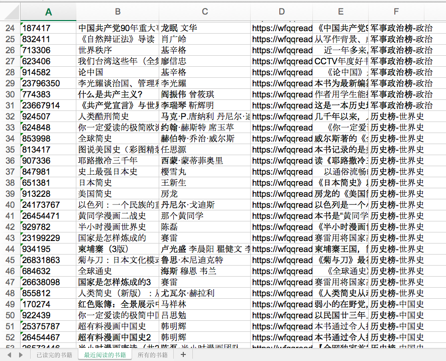

# 一键导出微信读书的书籍和笔记

> 本项目基于[@arry-lee](https://github.com/arry-lee)的项目[wereader](https://github.com/arry-lee/wereader/issues/20)修改而来，感谢原作者提供的源代码。

<br />

## 简介

全民阅读的时代已经来临，目前使用读书软件的用户数2.1亿，日活跃用户超过500万，其中19-35岁年轻用户占比超过60%，本科及以上学历用户占比高达80%，北上广深及其他省会城市/直辖市用户占比超过80%。**本人习惯使用微信读书，为了方便整理书籍和导出笔记，便开发了这个小工具。**

<br />
<br />

## 部分截图

<br />


<br />
<br />

## 代码思路

### 1. 目录结构
首先，我们先看一下整体目录结构

```bash
Code
├─ excel_func.py                   读写excel文件
├─ pyqt_gui.py                     PyQt GUI界面
└─ wereader.py                     微信读书相关api

```
- excel_func.py
使用xlrd和xlwt库对excel文件进行读写操作

- pyqt_gui.py
使用PyQt绘制GUI界面

- wereader.py
通过抓包解析获得相关api

<br />

### 2. excel_func.py

```python
def write_excel_xls(path, sheet_name_list, value):
    # 新建一个工作簿
    workbook = xlwt.Workbook()

    # 获取需要写入数据的行数
    index = len(value)

    for sheet_name in sheet_name_list:

        # 在工作簿中新建一个表格
        sheet = workbook.add_sheet(sheet_name)

        # 往这个工作簿的表格中写入数据
        for i in range(0, index):
            for j in range(0, len(value[i])):
                sheet.write(i, j, value[i][j])

    # 保存工作簿
    workbook.save(path)

```

**该函数的代码流程为:**

1. 创建excel文件
2. 创建表格
3. 往表格写入数据

<br />
<br />


### 3. pyqt_gui.py

```python
class MainWindow(QMainWindow):

    def __init__(self, *args, **kwargs):
        super().__init__(*args, **kwargs)

        self.DomainCookies = {}

        self.setWindowTitle('微信读书助手') # 设置窗口标题
        self.resize(900, 600) # 设置窗口大小
        self.setWindowFlags(Qt.WindowMinimizeButtonHint) # 禁止最大化按钮
        self.setFixedSize(self.width(), self.height()) # 禁止调整窗口大小

        url = 'https://weread.qq.com/#login' # 目标地址
        self.browser = QWebEngineView() # 实例化浏览器对象

        QWebEngineProfile.defaultProfile().cookieStore().deleteAllCookies() # 初次运行软件时删除所有cookies

        QWebEngineProfile.defaultProfile().cookieStore().cookieAdded.connect(self.onCookieAdd) # cookies增加时触发self.onCookieAdd()函数
        self.browser.loadFinished.connect(self.onLoadFinished) # 网页加载完毕时触发self.onLoadFinished()函数

        self.browser.load(QUrl(url)) # 加载网页
        self.setCentralWidget(self.browser) # 设置中心窗口
```

**该函数的代码流程为:**

1. 新建QT窗口
2. 实例化QWebEngineView对象
3. 绑定self.onCookieAdd事件
4. 绑定self.onLoadFinished事件
5. 加载网页

<br />
<br />

```python
    # 网页加载完毕事件
    def onLoadFinished(self):

        global USER_VID
        global HEADERS

        # 获取cookies
        cookies = ['{}={};'.format(key, value) for key,value in self.DomainCookies.items()]
        cookies = ' '.join(cookies)
        # 添加Cookie到header
        HEADERS.update(Cookie=cookies)

        # 判断是否成功登录微信读书
        if login_success(HEADERS):
            print('登录微信读书成功!')

            # 获取用户user_vid
            if 'wr_vid' in self.DomainCookies.keys():
                USER_VID = self.DomainCookies['wr_vid']
                print('用户id:{}'.format(USER_VID))

                # 关闭整个qt窗口
                self.close()

        else:
            print('请扫描二维码登录微信读书...')
```

**该函数的代码流程为:**

1. 当网页加载完毕时，检测是否成功登录微信读书
2. 如果成功登录微信读书，则关闭QT窗口，开始进行数据导出
3. 如果失败登录微信读书，则继续等待用户扫描二维码


<br />
<br />

```python
    # 添加cookies事件
    def onCookieAdd(self, cookie):
        if 'weread.qq.com' in cookie.domain():
            name = cookie.name().data().decode('utf-8')
            value = cookie.value().data().decode('utf-8')
            if name not in self.DomainCookies:
                self.DomainCookies.update({name: value})
```

**该函数的代码流程为:**

1. 保存微信读书网址的cookies，以便后续操作


<br />
<br />

```python
    books = get_bookshelf(USER_VID, HEADERS) # 获取书架上的书籍
    books_finish_read = books['finishReadBooks']
    books_recent_read = books['recentBooks']
    books_all = books['allBooks']
    write_excel_xls_append(data_dir + '我的书架.xls', '已读完的书籍', books_finish_read) # 追加写入excel文件
    write_excel_xls_append(data_dir + '我的书架.xls', '最近阅读的书籍', books_recent_read)  # 追加写入excel文件
    write_excel_xls_append(data_dir + '我的书架.xls', '所有的书籍', books_all)  # 追加写入excel文件

    # 获取书架上的每本书籍的笔记
    for index, book in enumerate(books_finish_read):
        book_id = book[0]
        book_name = book[1]
        notes = get_bookmarklist(book[0], HEADERS)

        with open(note_dir + book_name + '.txt', 'w') as f:
            f.write(notes)
        print('导出笔记 {} ({}/{})'.format(note_dir + book_name + '.txt', index+1, len(books_finish_read)))


```

**该函数的代码流程为:**

1. 调用write_excel_xls_append函数，保存书籍，并且导出笔记


<br />
<br />


### 4. wereader.py

```python
def get_bookshelf(userVid, headers):
    """获取书架上所有书"""
    url = "https://i.weread.qq.com/shelf/friendCommon"
    params = dict(userVid=userVid)
    r = requests.get(url, params=params, headers=headers, verify=False)
    if r.ok:
        data = r.json()
    else:
        raise Exception(r.text)

    books_finish_read = set() # 已读完的书籍
    books_recent_read = set() # 最近阅读的书籍
    books_all = set() # 书架上的所有书籍


    for book in data['recentBooks']:
        if not book['bookId'].isdigit(): # 过滤公众号
            continue
        b = Book(book['bookId'], book['title'], book['author'], book['cover'], book['intro'], book['category'])
        books_recent_read.add(b)

    books_all = books_finish_read + books_recent_read

    return dict(finishReadBooks=books_finish_read, recentBooks=books_recent_read, allBooks=books_all)

```

**该函数的代码流程为:**

1. 获取最近阅读的书籍、已经读完的书籍、所有书籍
2. 过滤公众号部分
2. 将书籍数据保存为字典格式

<br />
<br />

```python
def get_bookmarklist(bookId, headers):
    """获取某本书的笔记返回md文本"""
    url = "https://i.weread.qq.com/book/bookmarklist"
    params = dict(bookId=bookId)
    r = requests.get(url, params=params, headers=headers, verify=False)

    if r.ok:
        data = r.json()
        # clipboard.copy(json.dumps(data, indent=4, sort_keys=True))
    else:
        raise Exception(r.text)
    chapters = {c['chapterUid']: c['title'] for c in data['chapters']}
    contents = defaultdict(list)

    for item in sorted(data['updated'], key=lambda x: x['chapterUid']):
        # for item in data['updated']:
        chapter = item['chapterUid']
        text = item['markText']
        create_time = item["createTime"]
        start = int(item['range'].split('-')[0])
        contents[chapter].append((start, text))

    chapters_map = {title: level for level, title in get_chapters(int(bookId), headers)}
    res = ''
    for c in sorted(chapters.keys()):
        title = chapters[c]
        res += '#' * chapters_map[title] + ' ' + title + '\n'
        for start, text in sorted(contents[c], key=lambda e: e[0]):
            res += '> ' + text.strip() + '\n\n'
        res += '\n'

    return res
```

**该函数的代码流程为:**

1. 获取某一本书籍的笔记
2. 将返回的字符串改写成markdown格式并输出


<br />
<br />
<br />

## 如何运行

```bash
# 跳转到当前目录
cd 目录名
# 先卸载依赖库
pip uninstall -y -r requirement.txt
# 再重新安装依赖库
pip install -r requirement.txt -i https://pypi.tuna.tsinghua.edu.cn/simple
# 开始运行
python pyqt_gui.py
```

<br />
<br />

## 补充

完整版源代码存放在[github][5]上，有需要的可以下载

项目持续更新，欢迎您[star本项目][5]

<br />
<br />

## License
[The MIT License (MIT)][6]

[5]:https://github.com/shengqiangzhang/examples-of-web-crawlers
[6]:http://opensource.org/licenses/MIT
