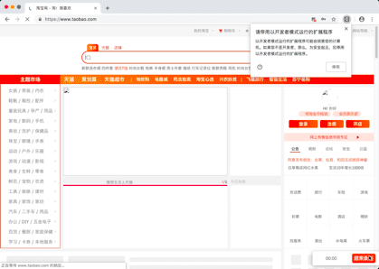
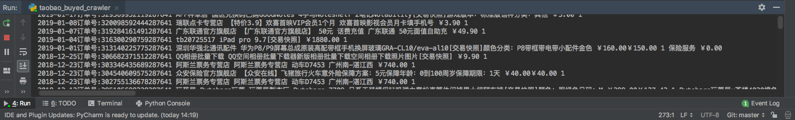

# 淘宝已买到的宝贝数据爬虫
## 使用教程
1. [点击这里下载][1]下载chrome浏览器
2. 查看chrome浏览器的版本号，[点击这里下载][2]对应版本号的chromedriver驱动
3. pip安装下列包
- [x] pip install selenium
- [x] pip install pyquery
4. [点击这里][3]登录微博，并通过微博绑定淘宝账号密码
5. 在main中填写chromedriver的绝对路径
6. 在main中填写微博账号密码

```python
	#改成你的chromedriver的完整路径地址
    chromedriver_path = "/Users/bird/Desktop/chromedriver.exe" 
    #改成你的微博账号
    weibo_username = "改成你的微博账号"
    #改成你的微博密码
    weibo_password = "改成你的微博密码"
```

## 演示图片





[1]:https://www.google.com/chrome/
[2]:http://chromedriver.storage.googleapis.com/index.html
[3]:https://account.weibo.com/set/bindsns/bindtaobao