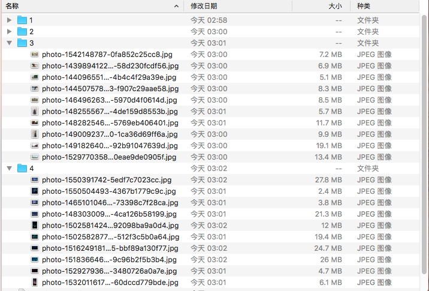
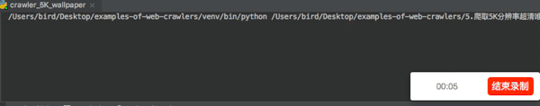

# 爬取5K分辨率超清唯美壁纸

## 简介

壁纸的选择其实很大程度上能看出电脑主人的内心世界，有的人喜欢风景，有的人喜欢星空，有的人喜欢美女，有的人喜欢动物。然而，终究有一天你已经产生审美疲劳了，但你下定决定要换壁纸的时候，又发现网上的壁纸要么分辨率低，要么带有水印。

<br />

这里有一款Mac下的小清新壁纸神器[Pap.er][3]，可能是Mac下最好的壁纸软件，**自带5K超清分辨率壁纸**，富有多种类型壁纸，当我们想在Windows或者Linux下使用的时候，就可以考虑将**5K超清分辨率壁纸**爬取下来。


## 功能截图






## 如何运行

```bash
# 跳转到当前目录
cd 目录名
# 先卸载依赖库
pip uninstall -y -r requirement.txt
# 再重新安装依赖库
pip install -r requirement.txt -i https://pypi.tuna.tsinghua.edu.cn/simple
# 开始运行
python main.py
```


## 编写思路

首先，打开Charles软件，进行抓包。打开[Pap.er][3]，开始抓包。抓包分析结果如下：

| 类型 | 地址                                                         |
| ---- | ------------------------------------------------------------ |
| 最新 | https://service.paper.meiyuan.in/api/v2/columns/flow/5c68ffb9463b7fbfe72b0db0?page=1&per_page=20 |
| 最热 | https://service.paper.meiyuan.in/api/v2/columns/flow/5c69251c9b1c011c41bb97be?page=1&per_page=20 |
| 女生 | https://service.paper.meiyuan.in/api/v2/columns/flow/5c81087e6aee28c541eefc26?page=1&per_page=20 |
| 星空 | https://service.paper.meiyuan.in/api/v2/columns/flow/5c81f64c96fad8fe211f5367?page=1&per_page=20 |

参数`page`不用改动，`per_page`指的是每页提取的数量，也就是我们想要提取的图片数量。


抓完包之后，我们开始编写5K壁纸解析程序

```python
# 爬取不同类型图片
def crawler_photo(type_id, photo_count):

    # 最新 1, 最热 2, 女生 3, 星空 4
    if(type_id == 1):
        url = 'https://service.paper.meiyuan.in/api/v2/columns/flow/5c68ffb9463b7fbfe72b0db0?page=1&per_page=' + str(photo_count)
    elif(type_id == 2):
        url = 'https://service.paper.meiyuan.in/api/v2/columns/flow/5c69251c9b1c011c41bb97be?page=1&per_page=' + str(photo_count)
    elif(type_id == 3):
        url = 'https://service.paper.meiyuan.in/api/v2/columns/flow/5c81087e6aee28c541eefc26?page=1&per_page=' + str(photo_count)
    elif(type_id == 4):
        url = 'https://service.paper.meiyuan.in/api/v2/columns/flow/5c81f64c96fad8fe211f5367?page=1&per_page=' + str(photo_count)

    
    headers = {"User-Agent": "Mozilla/5.0 (Windows NT 6.1; WOW64) AppleWebKit/537.36 (KHTML, like Gecko) Chrome/63.0.3239.132 Safari/537.36"}
    # 获取图片链接列表数据，json格式
    respond = requests.get(url, headers=headers)
    # 对json格式转化为python对象
    photo_data = json.loads(respond.content)

    # 已经下载的图片张数
    now_photo_count = 1
    # 所有图片张数
    all_photo_count = len(photo_data)

    # 开始下载并保存5K分辨率壁纸
    for photo in photo_data:

        # 创建一个文件夹存放我们下载的图片(若存在则不用重新创建)
        if not os.path.exists('./' + str(type_id)):
            os.makedirs('./' + str(type_id))

        # 准备下载的图片链接，5K超清壁纸链接
        file_url = photo['urls']['raw']

        # 准备下载的图片名称,不包含扩展名
        file_name_only = file_url.split('/')
        file_name_only = file_name_only[len(file_name_only) -1]

        # 准备保存到本地的完整路径
        file_full_name = './' + str(type_id) + '/' + file_name_only

        # 开始下载图片
        Down_load(file_url, file_full_name, now_photo_count, all_photo_count)
        
        # 已经下载的图片数量加1
        now_photo_count = now_photo_count + 1

```


根据不同类型的壁纸，创建不同的文件夹编号进行分类。

上面的`Down_load()`函数是下载文件的意思，调用`requests`库，具体代码如下：

```python
# 文件下载器
def Down_load(file_url, file_full_name, now_photo_count, all_photo_count):
    headers = {"User-Agent": "Mozilla/5.0 (Windows NT 6.1; WOW64) AppleWebKit/537.36 (KHTML, like Gecko) Chrome/63.0.3239.132 Safari/537.36"}

    # 开始下载图片
    with closing(requests.get(file_url, headers=headers, stream=True)) as response:
        chunk_size = 1024  # 单次请求最大值
        content_size = int(response.headers['content-length'])  # 文件总大小
        data_count = 0 # 当前已传输的大小
        with open(file_full_name, "wb") as file:
            for data in response.iter_content(chunk_size=chunk_size):
                file.write(data)
                done_block = int((data_count / content_size) * 50)
                data_count = data_count + len(data)
                now_jd = (data_count / content_size) * 100
                print("\r %s：[%s%s] %d%% %d/%d" % (file_full_name, done_block * '█', ' ' * (50 - 1 - done_block), now_jd, now_photo_count, all_photo_count), end=" ")

    # 下载完图片后获取图片扩展名，并为其增加扩展名
    file_type = filetype.guess(file_full_name)
    os.rename(file_full_name, file_full_name + '.' + file_type.extension)
```


`chunk_size`指的是单次请求的最大值，`content_size`指的就是我们下载5K超清壁纸的大小，为了能够直观显示下载情况，所以添加了下载进度条的显示效果。核心代码为`file.write(data)`。


下载完毕后，为了方便我们查看文件，所以需要给图片添加对应的扩展名，比如`jpg,png,gif`，这里使用到`filetype`库对文件进行解析，判断其类型。


最后，开始在main中爬取5K高清壁纸：

```python
if __name__ == '__main__':

    # 最新 1, 最热 2, 女生 3, 星空 4
    # 爬取类型为3的图片(女生),一共准备爬取100张
    print("程序已经开始运行,请稍等……")
    crawler_photo(1, 100)
    crawler_photo(2, 100)
    crawler_photo(3, 100)
    crawler_photo(4, 100)
```


## 完整源代码
项目源代码在[GitHub仓库][1]

项目持续更新，欢迎您[star本项目][1]


## License
[The MIT License (MIT)][2]


[1]:https://github.com/shengqiangzhang/examples-of-web-crawlers
[2]:http://opensource.org/licenses/MIT
[3]:http://paper.meiyuan.in/
