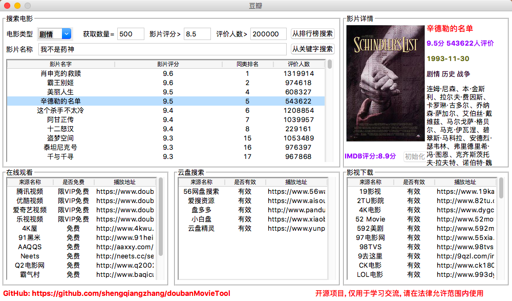

# 6.爬取豆瓣排行榜电影数据(含GUI界面版)

## 项目简介

这个项目源于大三某课程设计。平常经常需要搜索一些电影，但是不知道哪些评分高且评价人数多的电影。为了方便使用，就将原来的项目重新改写了。当做是对爬虫技术、可视化技术的实践了。主要是通过从排行榜和从影片关键词两种方式爬取电影数据。

## 功能截图

## 如何运行

1. 打开Chrome浏览器，在网址栏输入chrome://version/查询当前Chrome版本
2. 打开[http://chromedriver.storage.googleapis.com/index.html][1]，下载对应版本的chromedriver驱动，**下载完成后务必解压**
3. 打开当前目录下的文件`getMovieInRankingList.py`，定位到第`107行`，将`executable_path=./chromedriver.exe`修改为你的chromedriver驱动路径
4. 执行命令`pip install -r requirement.txt`安装程序所需的依赖包
5. 执行命令`python main.py`运行程序

## 包含功能

- [x] 根据关键字搜索电影
- [x] 根据排行榜(TOP250)搜索电影
- [x] 显示IMDB评分及其他基本信息
- [x] 提供多个在线视频站点，无需vip
- [x] 提供多个云盘站点搜索该视频，以便保存到云盘
- [x] 提供多个站点下载该视频
- [ ] 等待更新

## 补充

项目持续更新，欢迎您[star本项目][5]

## License
[The MIT License (MIT)][6]

[1]:http://chromedriver.storage.googleapis.com/index.html
[5]:https://github.com/shengqiangzhang/examples-of-web-crawlers
[6]:http://opensource.org/licenses/MIT

