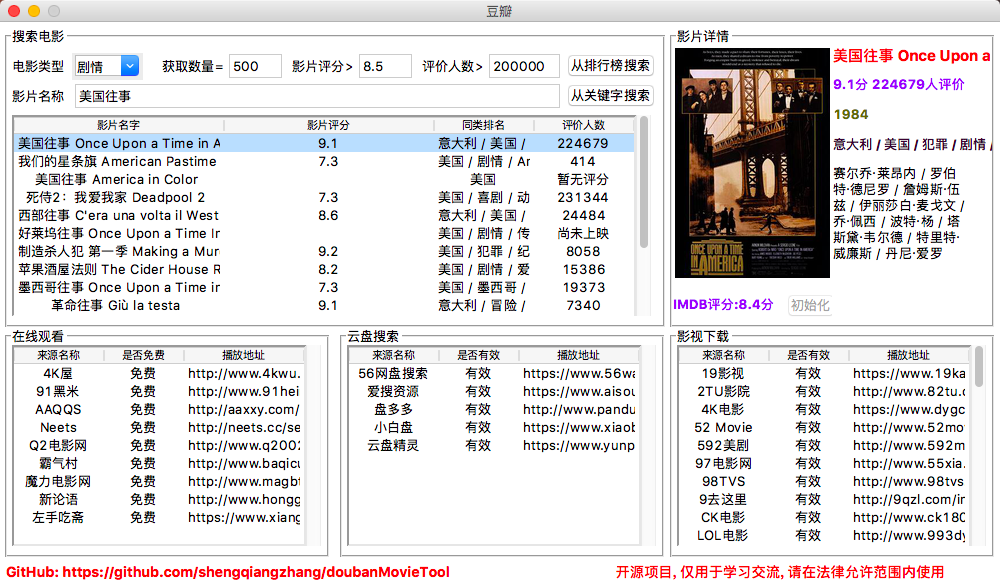

# 6.爬取豆瓣排行榜电影数据(含GUI界面版)

## 项目简介

这个项目源于大三某课程设计。平常经常需要搜索一些电影，但是不知道哪些评分高且评价人数多的电影。为了方便使用，就将原来的项目重新改写了。当做是对爬虫技术、可视化技术的实践了。主要是通过从排行榜和从影片关键词两种方式爬取电影数据。

## 配置说明

1. 打开[http://chromedriver.storage.googleapis.com/index.html][1]，根据自己的操作系统下载对应的chromedriver
2. 打开当前面目录下的**<u>getMovieInRankingList.py</u>**，定位到第59行，将`executable_path=/Users/bird/Desktop/chromedriver.exe`修改成你自己的chromedriver路径
3. 打开pycharm，依次安装以下包
- pip install Pillow
- pip install selenium

## 功能截图

## 包含功能

- [x] 根据关键字搜索电影
- [x] 根据排行榜(TOP250)搜索电影
- [x] 显示IMDB评分及其他基本信息
- [x] 提供多个在线视频站点，无需vip
- [x] 提供多个云盘站点搜索该视频，以便保存到云盘
- [x] 提供多个站点下载该视频
- [ ] 等待更新

## 存在问题

目前没有加入反爬虫策略，如果运行出现403 forbidden提示，则说明暂时被禁止，解决方式如下：

- 加入cookies
- 采用随机延时方式
- 采用IP代理池方式(较不稳定)

## 补充

项目持续更新，欢迎您[star本项目][5]

## License
[The MIT License (MIT)][6]

[1]:http://chromedriver.storage.googleapis.com/index.html
[5]:https://github.com/shengqiangzhang/examples-of-web-crawlers
[6]:http://opensource.org/licenses/MIT

