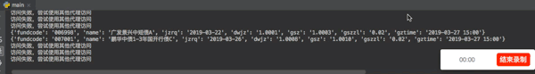

# 7.多线程+代理池爬取天天基金网、股票数据(无需使用爬虫框架)


## 简介

提到爬虫，大部分人都会想到使用Scrapy工具，但是仅仅停留在会使用的阶段。为了增加对爬虫机制的理解，我们可以手动实现多线程的爬虫过程，同时，引入IP代理池进行基本的反爬操作。

本次使用天天基金网进行爬虫，该网站具有反爬机制，同时数量足够大，多线程效果较为明显。


## 技术路线

- IP代理池
- 多线程
- 爬虫与反爬

## 编写思路


1. 首先，开始分析天天基金网的一些数据。经过抓包分析，可知：
[./fundcode_search.js](http://fund.eastmoney.com/js/fundcode_search.js)包含所有基金的数据，同时，该地址具有反爬机制，多次访问将会失败的情况。

2. 同时，经过分析可知某只基金的相关信息地址为:fundgz.1234567.com.cn/js/ + 基金代码 + .js

3. 分析完天天基金网的数据后，搭建IP代理池，用于反爬作用。点击这里[搭建代理池](https://github.com/1again/ProxyPool)，由于该作者提供了一个例子，所以本代码里面直接使用的是作者提供的接口。如果你需要更快速的获取到普匿IP，则可以自行搭建一个本地IP代理池。
```python
    # 返回一个可用代理，格式为ip:端口
    # 该接口直接调用github代理池项目给的例子，故不保证该接口实时可用
    # 建议自己搭建一个本地代理池，这样获取代理的速度更快
    # 代理池搭建github地址https://github.com/1again/ProxyPool
    # 搭建完毕后，把下方的proxy.1again.cc改成你的your_server_ip，本地搭建的话可以写成127.0.0.1或者localhost
    def get_proxy():
        data_json = requests.get("http://proxy.1again.cc:35050/api/v1/proxy/?type=2").text
        data = json.loads(data_json)
        return data['data']['proxy']
```

4. 搭建完IP代理池后，我们开始着手多线程爬取数据的工作。一旦使用多线程，则需要考虑到数据的读写顺序问题。这里使用python中的队列queue进行存储基金代码，不同线程分别从这个queue中获取基金代码，并访问指定基金的数据。由于queue的读取和写入是阻塞的，所以可以确保该过程不会出现读取重复和读取丢失基金代码的情况。
```python
    # 将所有基金代码放入先进先出FIFO队列中
    # 队列的写入和读取都是阻塞的，故在多线程情况下不会乱
    # 在不使用框架的前提下，引入多线程，提高爬取效率
    # 创建一个队列
    fund_code_queue = queue.Queue(len(fund_code_list))
    # 写入基金代码数据到队列
    for i in range(len(fund_code_list)):
        #fund_code_list[i]也是list类型，其中该list中的第0个元素存放基金代码
        fund_code_queue.put(fund_code_list[i][0])
```

5. 现在，开始编写如何获取指定基金的代码。首先，该函数必须先判断queue是否为空，当不为空的时候才可进行获取基金数据。同时，当发现访问失败时，则必须将我们刚刚取出的基金代码重新放回到队列中去，这样才不会导致基金代码丢失。
```python
    # 获取基金数据
    def get_fund_data():

        # 当队列不为空时
        while (not fund_code_queue.empty()):

            # 从队列读取一个基金代码
            # 读取是阻塞操作
            fund_code = fund_code_queue.get()

            # 获取一个代理，格式为ip:端口
            proxy = get_proxy()

            # 获取一个随机user_agent和Referer
            header = {'User-Agent': random.choice(user_agent_list),
                      'Referer': random.choice(referer_list)
            }

            try:
                req = requests.get("http://fundgz.1234567.com.cn/js/" + str(fund_code) + ".js", proxies={"http": proxy}, timeout=3, headers=header)
            except Exception:
                # 访问失败了，所以要把我们刚才取出的数据再放回去队列中
                fund_code_queue.put(fund_code)
                print("访问失败，尝试使用其他代理访问")
```

6. 当访问成功时，则说明能够成功获得基金的相关数据。当我们在将这些数据存入到一个.csv文件中，会发现数据出现错误。这是由于多线程导致，由于多个线程同时对该文件进行写入，导致出错。所以需要引入一个线程锁，确保每次只有一个线程写入。
```python
    # 申请获取锁，此过程为阻塞等待状态，直到获取锁完毕
    mutex_lock.acquire()

    # 追加数据写入csv文件，若文件不存在则自动创建
    with open('./fund_data.csv', 'a+', encoding='utf-8') as csv_file:
        csv_writer = csv.writer(csv_file)
        data_list = [x for x in data_dict.values()]
        csv_writer.writerow(data_list)

    # 释放锁
    mutex_lock.release()
```

7. 至此，大部分工作已经完成了。为了更好地实现伪装效果，我们对header进行随机选择。
```python
    # user_agent列表
    user_agent_list = [
        'Mozilla/5.0 (Windows NT 6.1; WOW64) AppleWebKit/537.1 (KHTML, like Gecko) Chrome/21.0.1180.71 Safari/537.1 LBBROWSER',
        'Mozilla/4.0 (compatible; MSIE 6.0; Windows NT 5.1; SV1; QQDownload 732; .NET4.0C; .NET4.0E)',
        'Mozilla/5.0 (Windows NT 5.1) AppleWebKit/535.11 (KHTML, like Gecko) Chrome/17.0.963.84 Safari/535.11 SE 2.X MetaSr 1.0',
        'Mozilla/5.0 (Windows NT 6.1; WOW64) AppleWebKit/537.36 (KHTML, like Gecko) Maxthon/4.4.3.4000 Chrome/30.0.1599.101 Safari/537.36',
        'Mozilla/5.0 (Windows NT 6.1; WOW64) AppleWebKit/537.36 (KHTML, like Gecko) Chrome/38.0.2125.122 UBrowser/4.0.3214.0 Safari/537.36'
    ]

    # referer列表
    referer_list = [
        'http://fund.eastmoney.com/110022.html',
        'http://fund.eastmoney.com/110023.html',
        'http://fund.eastmoney.com/110024.html',
        'http://fund.eastmoney.com/110025.html'
    ]

    # 获取一个随机user_agent和Referer
    header = {'User-Agent': random.choice(user_agent_list),
              'Referer': random.choice(referer_list)
    }
```

8. 最后，在main中，开启线程即可。
```python
    # 创建一个线程锁，防止多线程写入文件时发生错乱
    mutex_lock = threading.Lock()
    # 线程数为50，在一定范围内，线程数越多，速度越快
    for i in range(50):
    	t = threading.Thread(target=get_fund_data,name='LoopThread'+str(i))
    	t.start()
```

9. 通过对多线程和IP代理池的实践操作，能够更加深入了解多线程和爬虫的工作原理。当你在使用一些爬虫框架的时候，就能够做到快速定位错误并解决错误。


## 数据格式
000056,建信消费升级混合,2019-03-26,1.7740,1.7914,0.98,2019-03-27 15:00

000031,华夏复兴混合,2019-03-26,1.5650,1.5709,0.38,2019-03-27 15:00

000048,华夏双债增强债券C,2019-03-26,1.2230,1.2236,0.05,2019-03-27 15:00

000008,嘉实中证500ETF联接A,2019-03-26,1.4417,1.4552,0.93,2019-03-27 15:00

000024,大摩双利增强债券A,2019-03-26,1.1670,1.1674,0.04,2019-03-27 15:00

000054,鹏华双债增利债券,2019-03-26,1.1697,1.1693,-0.03,2019-03-27 15:00

000016,华夏纯债债券C,2019-03-26,1.1790,1.1793,0.03,2019-03-27 15:00


## 功能截图



## 配置说明

```python

# 确保安装以下库，如果没有，请在python3环境下执行pip install 模块名
    import requests
    import random
    import re
    import queue
    import threading
    import csv
    import json

```


## 补充

完整版源代码存放在[github][5]上，有需要的可以下载

项目持续更新，欢迎您[star本项目][5]


## License
[The MIT License (MIT)][6]

[5]:https://github.com/shengqiangzhang/examples-of-web-crawlers
[6]:http://opensource.org/licenses/MIT


