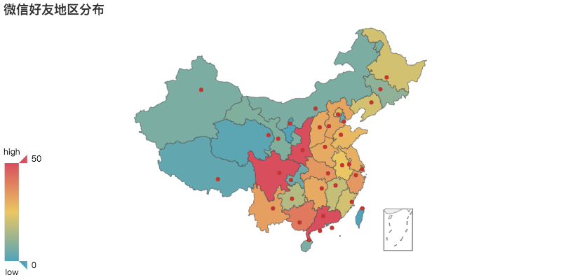
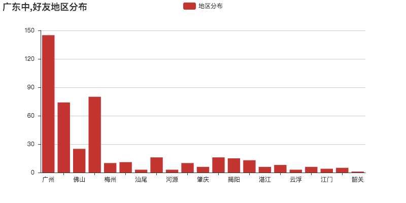
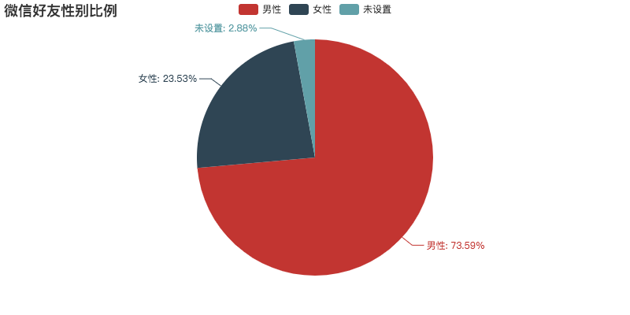
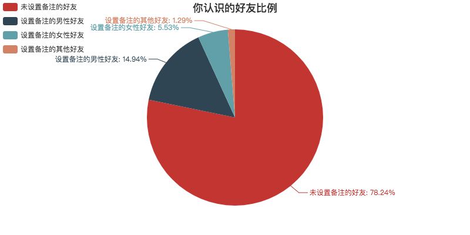
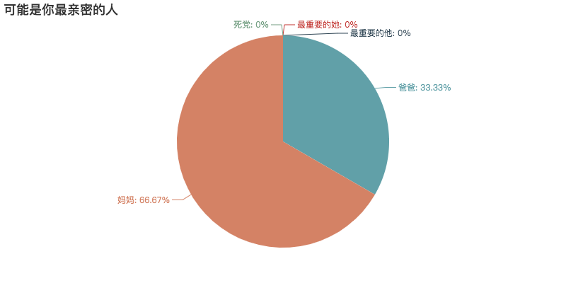
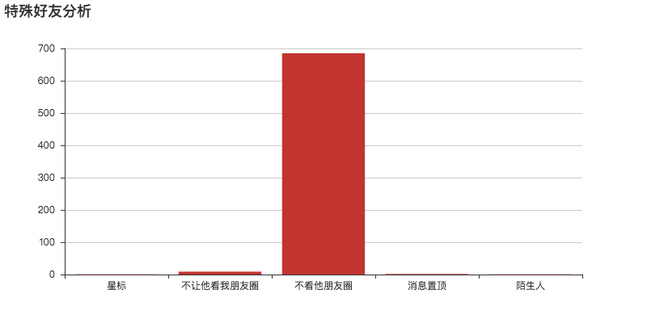
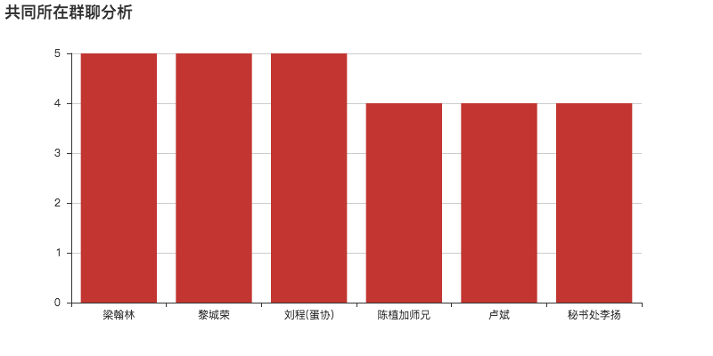

# 8.一键生成微信个人专属数据报告(了解你的微信社交历史)


## 简介

你是否想过生成一份属于你的微信个人数据报告，了解你的微信社交历史。现在，我们基于python对微信好友进行全方位数据分析，包括：昵称、性别、年龄、地区、备注名、个性签名、头像、群聊、公众号等。

其中，在分析好友类型方面，主要统计出你的陌生人、星标好友、不让他看我的朋友圈的好友、不看他的朋友圈的好友数据。在分析地区方面，主要统计所有好友在全国的分布以及对好友数最多的省份进行进一步分析。在其他方面，统计出你的好友性别比例、猜出你最亲密的好友，分析你的特殊好友，找出与你所在共同群聊数最多的好友数据，对你的好友个性签名进行分析，对你的好友头像进行分析，并进一步检测出使用真人头像的好友数据。

目前网上关于这方面的数据分析文章比较多，但是运行起来比较麻烦，**而本程序的运行十分简单，只需要扫码登录一步操作即可。**


## 功能截图










## 如何运行
```bash
# 跳转到当前目录
cd 目录名
# 先卸载依赖库
pip uninstall -y -r requirement.txt
# 再重新安装依赖库
pip install -r requirement.txt
# 开始运行
python generate_wx_data.py
```

## 如何打包成二进制可执行文件
```bash
# 安装pyinstaller
pip install pyinstaller
# 跳转到当前目录
cd 目录名
# 先卸载依赖库
pip uninstall -y -r requirement.txt
# 再重新安装依赖库
pip install -r requirement.txt
# 更新 setuptools
pip install --upgrade setuptools
# 开始打包
pyinstaller generate_wx_data.py
```


## 编写思路

1. 首先，进行初始化，并根据不同操作系统，启用微信机器人。
```python
    # 初始化所需文件夹
    init_folders()


    # 启动微信机器人，自动根据操作系统执行不同的指令
    if('Windows' in system()):
        # Windows
        bot = Bot(cache_path=True)
    elif('Darwin' in system()):
        # MacOSX
        bot = Bot(cache_path=True)
    elif('Linux' in system()):
        # Linux
        bot = Bot(console_qr=2,cache_path=True)
    else:
        # 自行确定
        print(u"无法识别你的操作系统类型，请自己设置")
        exit()
```

2. 登录完微信后，开始获取好友数据和群聊数据。
```python
# 获取所有好友
friends = bot.friends(update=False)

# 获取所有活跃群聊
groups = bot.groups()
```

3. 共同所在群聊成员分析，依次对每个好友进行检测。
```python
def group_common_in():

    # 获取所有活跃的群聊
    groups = bot.groups()

    # 每个好友与你相同的群聊个数
    dict_common_in = {}

    # 遍历所有好友，第0个为你自己，所以去掉
    for x in friends[1:]:
        # 依次在每个群聊中搜索
        for y in groups:
            # x在y中
            if(x in y):
                # 获取微信名称
                name = x.nick_name
                # 判断是否有备注，有的话就使用备注
                if(x.remark_name and x.remark_name != ''):
                    name = x.remark_name

                # 增加计数
                if(name in dict_common_in.keys()):
                    dict_common_in[name] += 1
                else:
                    dict_common_in[name] = 1
```


4. 获取微信好友头像，以便进一步分析。这里下载头像比较慢，所以采取多线程方式进行下载。在多线程中，使用队列保存我们的头像url，不同线程从队列中获取头像url，并下载到本地。
```python
    # 创建一个队列，用于多线程下载头像，提高下载速度
    queue_head_image = Queue()

    # 将每个好友元素存入队列中
    # 如果为了方便调试，可以仅仅插入几个数据，friends[1:10]
    for user in friends:
        queue_head_image.put(user)

    # 启动10个线程下载头像
    for i in range(1, 10):
        t = Thread(target=download_head_image,args=(i,))
        t.start()
```

其中`download_head_image`的具体实现为：
```python
# 下载好友头像，此步骤消耗时间比较长
def download_head_image(thread_name):

    # 队列不为空的情况
    while(not queue_head_image.empty()):
        # 取出一个好友元素
        user = queue_head_image.get()

        # 下载该好友头像，并保存到指定位置，生成一个15位数的随机字符串
        random_file_name = ''.join([str(random.randint(0,9)) for x in range(15)])
        user.get_avatar(save_path='image/' + random_file_name + '.jpg')

        # 输出提示
        print(u'线程%d:正在下载微信好友头像数据，进度%d/%d，请耐心等待……' %(thread_name, len(friends)-queue_head_image.qsize(), len(friends)))
```

5. 进行性别、地区统计，并将生产的html文件保存到本地。这里没什么难度，所以就不详细展开了。
```python
# 分析好友性别比例
def sex_ratio():

    # 初始化
    male, female, other = 0, 0, 0

    # 遍历
    for user in friends:
        if(user.sex == 1):
            male += 1
        elif(user.sex == 2):
            female += 1
        else:
            other += 1

    name_list = ['男性', '女性', '未设置']
    num_list = [male, female, other]

    pie = Pie("微信好友性别比例")
    pie.add("", name_list, num_list, is_label_show=True)
    pie.render('data/好友性别比例.html')
```

6. 分析你认识的好友、最亲密的人以及特殊好友。以特殊好友为例，我们将好友分为星标好友(很重要的人), 不让他看我的朋友圈的好友, 不看他朋友圈的好友, 消息置顶好友, 陌生人。这里分类的依据是根据itchat中的`StarFriend`和`ContactFlag`而来的。根据经验可知，`StarFriend`为1表示为星标好友，`ContactFlag`为1和3表示好友，259和33027表示不让他看我的朋友圈，65539和65537和66051表示不看他的朋友圈，65795表示两项设置全禁止, 73731表示陌生人。
```python
# 特殊好友分析
def analyze_special_friends():

    # 星标好友(很重要的人), 不让他看我的朋友圈的好友, 不看他朋友圈的好友, 消息置顶好友, 陌生人
    star_friends, hide_my_post_friends, hide_his_post_friends, sticky_on_top_friends, stranger_friends = 0, 0, 0, 0, 0

    for user in friends:


        # 星标好友为1,为0表示非星标,不存在星标选项的为陌生人
        if('StarFriend' in (user.raw).keys()):
            if((user.raw)['StarFriend'] == 1):
                star_friends += 1
        else:
            stranger_friends += 1

        # 好友类型及权限：1和3好友，259和33027不让他看我的朋友圈，65539和65537和66051不看他的朋友圈，65795两项设置全禁止, 73731陌生人
        if((user.raw)['ContactFlag'] in [259, 33027, 65795]):
            hide_my_post_friends += 1
        if ((user.raw)['ContactFlag'] in [66051, 65537, 65539, 65795]):
            hide_his_post_friends += 1

        # 消息置顶好友为2051
        if ((user.raw)['ContactFlag'] in [2051]):
            sticky_on_top_friends += 1

        # 陌生人
        if ((user.raw)['ContactFlag'] in [73731]):
            stranger_friends += 1


    bar = Bar('特殊好友分析')
    bar.add(name='', x_axis=['星标', '不让他看我朋友圈', '不看他朋友圈', '消息置顶', '陌生人'], y_axis=[star_friends, hide_my_post_friends, hide_his_post_friends, sticky_on_top_friends, stranger_friends], legend_orient="vertical", legend_pos="left")
    bar.render('data/特殊好友分析.html')

```

7. 对好友个性签名进行分析，并绘制出词语。这里比较复杂，首先将个性签名列表转化为字符串，调用nlp处理接口，对返回的数据进行过滤。同时，对短语进行分词，过滤，词频统计操作。最后，使用pyechart进行绘制词语图。代码中注释非常多，基本都能看懂，所以在此也无需再详细展开了。

```python
# 分析个性签名
def analyze_signature():

    # 个性签名列表
    data = []
    for user in friends:

        # 清除签名中的微信表情emoj，即<span class.*?</span>
        # 使用正则查找并替换方式，user.signature为源文本，将<span class.*?</span>替换成空
        new_signature = re.sub(re.compile(r"<span class.*?</span>", re.S), "", user.signature)

        # 只保留签名为1行的数据，过滤为多行的签名
        if(len(new_signature.split('\n')) == 1):
            data.append(new_signature)

    # 将个性签名列表转为string
    data = '\n'.join(data)

    # 进行分词处理，调用接口进行分词
    # 这里不使用jieba或snownlp的原因是无法打包成exe文件或者打包后文件非常大
    postData = {'data':data, 'type':'exportword', 'arg':'', 'beforeSend':'undefined'}
    response = post('http://life.chacuo.net/convertexportword',data=postData)
    data = response.text.replace('{"status":1,"info":"ok","data":["', '')
    # 解码
    data = data.encode('utf-8').decode('unicode_escape')

    # 将返回的分词结果json字符串转化为python对象，并做一些处理
    data = data.split("=====================================")[0]

    # 将分词结果转化为list，根据分词结果，可以知道以2个空格为分隔符
    data = data.split('  ')

    # 对分词结果数据进行去除一些无意义的词操作
    stop_words_list = [',', '，', '、', 'the', 'a', 'is', '…', '·', 'э', 'д', 'э', 'м', 'ж', 'и', 'л', 'т', 'ы', 'н', 'з', 'м', '…', '…', '…', '…', '…', '、', '.', '。', '!', '！', ':', '：', '~', '|', '▽', '`', 'ノ', '♪', 'a', 'b', 'c', 'd', 'e', 'f', 'g', 'h', 'i', 'j', 'k', 'l', 'm', 'n', 'o', 'p', 'q', 'r', 's', 't', 'u', 'v', 'w', 'x', 'y', 'z', 'A', 'B', 'C', 'D', 'E', 'F', 'G', 'H', 'I', 'J', 'K', 'L', 'M', 'N', 'O', 'P', 'Q', 'R', 'S', 'T', 'U', 'V', 'W', 'X', 'Y', 'Z', '0', '1', '2', '3', '4', '5', '6', '7', '8', '9', '\'', '‘', '’', '“', '”', '的', '了', '是', '你', '我', '他', '她','=', '\r', '\n', '\r\n', '\t', '以下关键词', '[', ']', '{', '}', '(', ')', '（', '）', 'span', '<', '>', 'class', 'html', '?', '就', '于', '下', '在', '吗', '嗯']
    tmp_data = []
    for word in data:
        if(word not in stop_words_list):
            tmp_data.append(word)
    data = tmp_data


    # 进行词频统计，结果存入字典signature_dict中
    signature_dict = {}
    for index, word in enumerate(data):

        print(u'正在统计好友签名数据，进度%d/%d，请耐心等待……' % (index + 1, len(data)))

        if(word in signature_dict.keys()):
            signature_dict[word] += 1
        else:
            signature_dict[word] = 1

    # 开始绘制词云
    name = [x for x in signature_dict.keys()]
    value = [x for x in signature_dict.values()]
    wordcloud = WordCloud('微信好友个性签名词云图')
    wordcloud.add("", name, value, shape='star', word_size_range=[1,100])
    wordcloud.render('data/好友个性签名词云.html')

```

8. 拼接所有好友头像，这里使用到PIL的图像处理功能，首先对头像个数进行统计，自适应生成矩形图片。由于我们知道微信头像尺寸为640 * 640，所以处理起来就很方便了。

```python
# 拼接所有微信好友头像
def merge_head_image():
    # 拼接头像
    pics = listdir('image')  # 得到user目录下的所有文件，即各个好友头像
    numPic = len(pics)
    eachsize = int(math.sqrt(float(640 * 640) / numPic))  # 先圈定每个正方形小头像的边长，如果嫌小可以加大
    numrow = int(640 / eachsize)
    numcol = int(numPic / numrow)  # 向下取整
    toImage = Image.new('RGB', (eachsize * numrow, eachsize * numcol))  # 先生成头像集模板

    x = 0  # 小头像拼接时的左上角横坐标
    y = 0  # 小头像拼接时的左上角纵坐标

    for index, i in enumerate(pics):

        print(u'正在拼接微信好友头像数据，进度%d/%d，请耐心等待……' % (index + 1, len(pics)))

        try:
            # 打开图片
            img = Image.open('image/' + i)
        except IOError:
            print(u'Error: 没有找到文件或读取文件失败')
        else:
            # 缩小图片
            img = img.resize((eachsize, eachsize), Image.ANTIALIAS)
            # 拼接图片
            toImage.paste(img, (x * eachsize, y * eachsize))
            x += 1
            if x == numrow:
                x = 0
                y += 1

    toImage.save('data/拼接' + ".jpg")
```

9. 检测使用人脸作为头像的好友数量，这里使用到opencv的人脸检测功能，使用opencv默认的模型进行检测。首先载入图片，并进行灰度处理，最后加载人脸识别模型进行检测，若检测到脸数大于0，则说明存在。同时要注意的是，对错误的头像要进行舍弃操作。

```python
# 检测使用真实人脸的好友个数
def detect_human_face():

    # 得到user目录下的所有文件名称，即各个好友头像
    pics = listdir('image')

    # 使用人脸的头像个数
    count_face_image = 0

    # 存储使用人脸的头像的文件名
    list_name_face_image = []

    # 加载人脸识别模型
    face_cascade = CascadeClassifier('model/haarcascade_frontalface_default.xml')

    for index, file_name in enumerate(pics):
        print(u'正在进行人脸识别，进度%d/%d，请耐心等待……' % (index+1, len(pics)))
        # 读取图片
        img = imread('image/' + file_name)

        # 检测图片是否读取成功，失败则跳过
        if img is None:
            continue

        # 对图片进行灰度处理
        gray = cvtColor(img, COLOR_BGR2GRAY)
        # 进行实际的人脸检测，传递参数是scaleFactor和minNeighbor,分别表示人脸检测过程中每次迭代时图
        faces = face_cascade.detectMultiScale(gray, 1.3, 5)
        if (len(faces) > 0):
            count_face_image += 1
            list_name_face_image.append(file_name)

    print(u'使用人脸的头像%d/%d' %(count_face_image,len(pics)))
```


10. 所有数据统计完后，我们生产一个总的html网页文件，方便我们直接查看。
```python
# 生成一个html文件，并保存到文件file_name中
def generate_html(file_name):
    with open(file_name, 'w', encoding='utf-8') as f:
        data = '''
            <meta http-equiv='Content-Type' content='text/html; charset=utf-8'>
            <meta charset="UTF-8">
            <title>一键生成微信个人专属数据报告(了解你的微信社交历史)</title>
            <meta name='keywords' content='微信个人数据'>
            <meta name='description' content=''>
            <iframe name="iframe1" marginwidth=0 marginheight=0 width=100% height=60% src="data/好友地区分布.html" frameborder=0></iframe>
            <iframe name="iframe2" marginwidth=0 marginheight=0 width=100% height=60% src="data/某省好友地区分布.html" frameborder=0></iframe>
            <iframe name="iframe3" marginwidth=0 marginheight=0 width=100% height=60% src="data/好友性别比例.html" frameborder=0></iframe>
            <iframe name="iframe4" marginwidth=0 marginheight=0 width=100% height=60% src="data/你认识的好友比例.html" frameborder=0></iframe>
            <iframe name="iframe5" marginwidth=0 marginheight=0 width=100% height=60% src="data/你最亲密的人.html" frameborder=0></iframe>
            <iframe name="iframe6" marginwidth=0 marginheight=0 width=100% height=60% src="data/特殊好友分析.html" frameborder=0></iframe>
            <iframe name="iframe7" marginwidth=0 marginheight=0 width=100% height=60% src="data/共同所在群聊分析.html" frameborder=0></iframe>
            <iframe name="iframe8" marginwidth=0 marginheight=0 width=100% height=60% src="data/好友个性签名词云.html" frameborder=0></iframe>
            <iframe name="iframe9" marginwidth=0 marginheight=0 width=100% height=60% src="data/微信好友头像拼接图.html" frameborder=0></iframe>
            <iframe name="iframe10" marginwidth=0 marginheight=0 width=100% height=60% src="data/使用人脸的微信好友头像拼接图.html" frameborder=0></iframe>
        '''
        f.write(data)
```


## 补充

完整版源代码存放在[github][5]上，有需要的可以下载

项目持续更新，欢迎您[star本项目][5]

## License
[The MIT License (MIT)][6]

[5]:https://github.com/shengqiangzhang/examples-of-web-crawlers
[6]:http://opensource.org/licenses/MIT