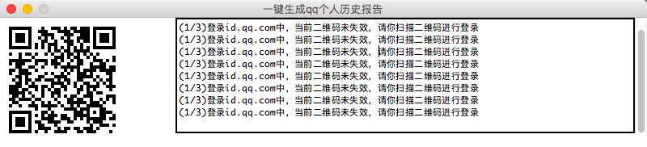
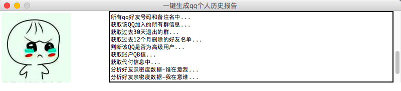
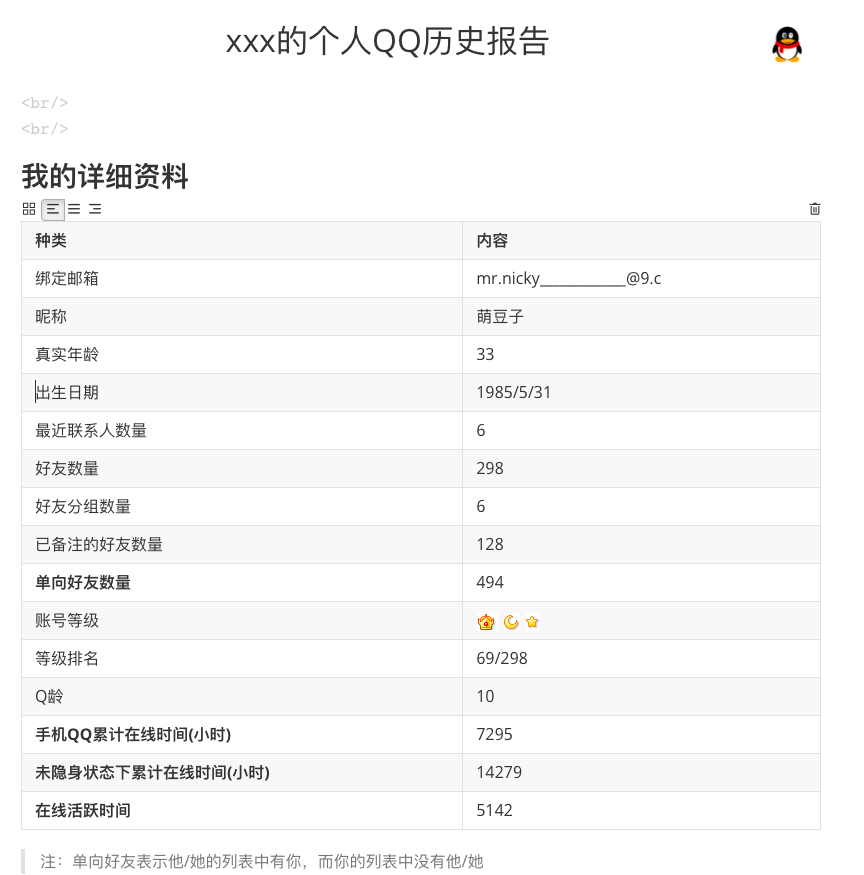
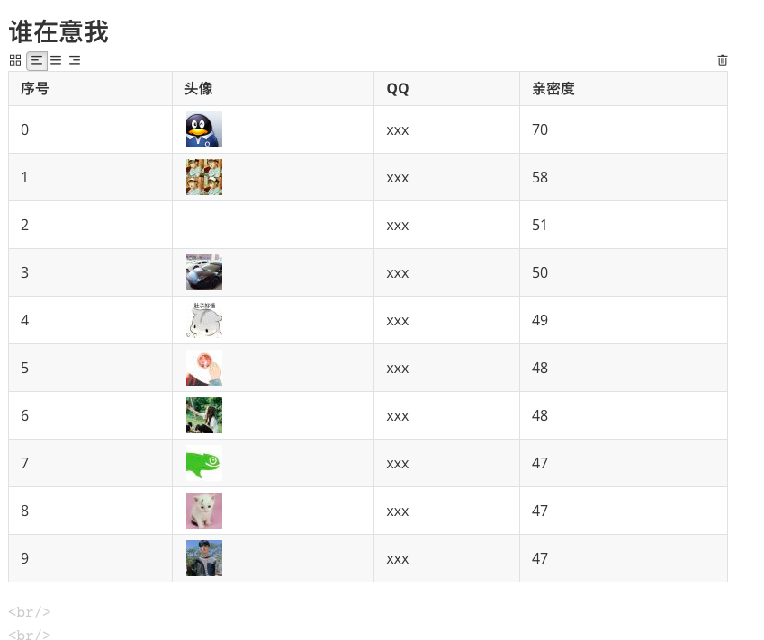

# 9.一键生成QQ个人历史报告


## 简介

近几年，由于微信的流行，大部分人不再频繁使用QQ，所以我们对于自己的QQ数据并不是特别了解。我相信，如果能够生成一份属于自己的QQ历史报告，那将是无比开心的一件事。


目前网上关于QQ的数据分析工具较少，原因是QQ相关接口比较复杂。**而本程序的运行十分简单，具有良好的用户交互界面，只需要扫码登录一步操作即可。**


目前本程序获取的数据包括：QQ详细数据、手机在线时间、非隐身状态下在线时间、QQ活跃时间、单向好友数量、QQ财产分析、群聊分析、过去一年我退出的群聊数据、退去一个月我删除的好友数据、所有代付信息、我最在意的人以及最在意我的人。**由于相关的数据接口有访问限制，所以本程序并没有对QQ好友进行分析。**


## 功能截图







## 如何运行
```bash
# 跳转到当前目录
cd 目录名
# 先卸载依赖库
pip uninstall -y -r requirement.txt
# 再重新安装依赖库
pip install -r requirement.txt
# 开始运行
python main.py
```


## 编写思路

本程序分为多个模块，模块如下：
1. main.py，主程序，用于获取并处理相关数据，并导出数据报告。
2. qq_bot.py， 核心模块，实现了qq相关的接口，较为复杂。
3. tkinter_gui.py，绘制gui模块，使用tkinter绘制基本的交互界面。
4. static_data.py，数据存储模块，所有数据采用base64编码存储。

### main.py模块
首先，初始化相关文件夹，并调用qq_bot.py模块，定义一个qq bot对象，该对象为本程序的核心对象，所有数据获取均从该对象获取。
同时，本程序数据的报告文件为`.md`格式
```python
	# 初始化文件夹
	init_folders()
	# 写入项目所需资源文件到本地目录
	write_data()

	# 创建一个自己编写的qq bot对象
	bot = Bot()
	custom_print(u'登录成功,正在获取数据...')

	# 定义欲输出的markdown字符串
	markdown_content = '''
	<p align="center">
	<font size='6px'>{qq_number}的个人QQ历史报告</font>
	
	</p>
	'''
	# 更新一下欲输出的markdown文本
	markdown_content = markdown_content.replace('{qq_number}',bot.qq_number)
	markdown_content = markdown_content.replace('{qq_icon_png}', 'data/qq_icon.png')
```

登录成功后，开始获取该登录账户的详细资料
```python
    custom_print(u'正在获取该登录账户的详细数据...')
    detail_information = bot.get_detail_information()
    # content为markdown语法文本
    content = '\n<br/><br/>\n' + '## 我的详细资料\n' + '种类|内容\n:- | :-\n'
        for key, value in detail_information.items():
        if key == 'qq_level':
            star_count, moon_count, sun_count, crown_count = calculate_level(value)
            data = crown_count * '' + sun_count * '' + moon_count * '' + star_count * ''
            content += '{}|{}\n'.format(key_dict[key], data)
        else:
            content += '{}|{}\n'.format(key_dict[key], value)
    # 更新一下欲输出的markdown文本
    markdown_content += content
    markdown_content += '\n> 注：单向好友表示他/她的列表中有你，而你的列表中没有他/她'
    # 每个步骤完成后，保存markdown文件，以便防止程序出错时能够保存到最新的数据
    with open('{}的个人QQ历史报告.md'.format(bot.qq_number), 'w', encoding='utf-8') as file:
        file.write(markdown_content)
```

接着，获取所有qq好友的备注名和qq号
```python
    all_qq_friends = bot.get_all_friends_in_qq()
    custom_print(u'所有qq好友号码和备注名中...')
    qq_number_list = []
    for key, friend_group in all_qq_friends.items():
        for info in friend_group['mems']:
            qq_number_list.append(info['uin'])
```

并获取所有群数据
```python
    # 获取所有群信息
    custom_print(u'获取该QQ加入的所有群信息...')
    group_list = bot.get_group()
    print(group_list)
    # content为markdown语法文本
    content = '\n\n<br/><br/>\n' + '## 我加入的群资料\n' + '序号|群名|群号|群主QQ\n:- | :-| :-| :-\n'
    # 获取某个群的群成员信息
    for index, group in enumerate(group_list):
        group_number = group['gc']
        group_name = group['gn']
        owner = group['owner']
        content += '{}|{}|{}|{}\n'.format(str(index+1), str(group_name), str(group_number), str(owner))

    # 更新一下欲输出的markdown文本
    markdown_content += content
    # 每个步骤完成后，保存markdown文件，以便防止程序出错时能够保存到最新的数据
    with open('{}的个人QQ历史报告.md'.format(bot.qq_number), 'w', encoding='utf-8') as file:
        file.write(markdown_content)
```

接下来的步骤如你所需，也就是获取其他相关的数据，所以本小节就不一一详细解释了，您可以查看相关源代码查看。获取的数据包括：
1. 获取过去30天内退出的群名单
2. 获取过去364天内删除的好友名单
3. 判断此次登录的qq是否为vip或者svip
4. 获取qb值
5. 获取代付信息
6. 亲密度排行榜
7. 共同好友数
8. 成为好友的天数


## qq_bot模块
此模块实现了获取qq数据的接口，主要通过抓包获得数据、分析数据，对参数进行加密解密等。

首先，是模拟扫码登录id.qq.com，qun.qq.com，qzone.qq.com。三者登录方式大同小异，唯一有区别的就是提交数据中的参数加密方式不同。
我们以id.qq.com登录为例:
```python
    def login_id_qq_com(self):
        # 登录id.qq.com

        # 访问网页，为了获取参数pt_login_sig
        login_url = 'https://xui.ptlogin2.qq.com/cgi-bin/xlogin?pt_disable_pwd=1&appid=1006102&daid=1&style=23&hide_border=1&proxy_url=https://id.qq.com/login/proxy.html&s_url=https://id.qq.com/index.html'
        html = get_html(login_url, '')
        # 对返回的cookies进行转化为dict类型，方便处理
        cookies_back_dict = dict_from_cookiejar(html.cookies)
        pt_login_sig = cookies_back_dict['pt_login_sig']
        self.cookies_merge_dict_in_id_qq_com.update(cookies_back_dict)

        # 访问网页，为了获取参数ptqrtoken
        qrcode_url = 'https://ssl.ptlogin2.qq.com/ptqrshow?appid=1006102&e=2&l=M&s=4&d=72&v=4&t=0.10239549811477189&daid=1&pt_3rd_aid=0'
        html = get_html(qrcode_url, '')
        # 对返回的cookies进行转化为dict类型，方便处理
        cookies_back_dict = dict_from_cookiejar(html.cookies)
        qrsig = cookies_back_dict['qrsig']
        ptqrtoken = hash33_token(qrsig)
        self.cookies_merge_dict_in_id_qq_com.update(cookies_back_dict)


        # 将二维码显示到图片框
        BytesIOObj = BytesIO()
        BytesIOObj.write(html.content)
        qr_code = PIL.Image.open(BytesIOObj)
        image = PIL.ImageTk.PhotoImage(qr_code)
        image_label['image'] = image


        # 实时检测二维码状态
        while (True):
            # 目标网址
            target_url = 'https://ssl.ptlogin2.qq.com/ptqrlogin?u1=https://id.qq.com/index.html&ptqrtoken=' + str(ptqrtoken) + '&ptredirect=1&h=1&t=1&g=1&from_ui=1&ptlang=2052&action=0-0-1556812236254&js_ver=19042519&js_type=1&login_sig=' + str(pt_login_sig) + '&pt_uistyle=40&aid=1006102&daid=1&'

            # 登录，需要带上访问cookies
            html = get_html(target_url, self.cookies_merge_dict_in_id_qq_com)

            # 返回的响应码为200说明二维码没过期
            if (html.status_code):
                if ('二维码未失效' in html.text):
                    custom_print(u'(1/3)登录id.qq.com中，当前二维码未失效，请你扫描二维码进行登录')
                elif ('二维码认证' in html.text):
                    custom_print(u'(1/3)登录id.qq.com中，扫描成功，正在认证中')
                elif ('登录成功' in html.text):
                    self.is_login = True
                    custom_print(u'(1/3)登录id.qq.com中，登录成功')
                    break
                if ('二维码已经失效' in html.text):
                    custom_print(u'(1/3)登录id.qq.com中，当前二维码已失效，请重启本软件')
                    exit()

            # 延时
            time.sleep(2)

        # 登录成功后，把返回的cookies合并进去
        self.cookies_merge_dict_in_id_qq_com = dict_from_cookiejar(html.cookies)
        self.cookies_merge_dict_in_id_qq_com.update(cookies_back_dict)
        # print(u'当前cookies:{}'.format(cookies_merge_dict))

        # 获取此次登录的qq号码
        qq_list = re.findall(r'&uin=(.+?)&service', html.text)
        self.qq_number = qq_list[0]


        # 登录成功后，会返回一个地址，需要对该地址进行访问以便获取新的返回cookies
        startIndex = (html.text).find('http')
        endIndex = (html.text).find('pt_3rd_aid=0')
        url = (html.text)[startIndex:endIndex] + 'pt_3rd_aid=0'

        # 屏蔽https证书警告
        urllib3.disable_warnings()

        # 这里需要注意的是，需要禁止重定向，才能正确获得返回的cookies
        html = get(url, cookies=self.cookies_merge_dict_in_id_qq_com, allow_redirects=False, verify=False)
        # 把返回的cookies合并进去
        cookies_back_dict = dict_from_cookiejar(html.cookies)
        self.cookies_merge_dict_in_id_qq_com.update(cookies_back_dict)

```
首先是访问指定网址，获取参数`pt_login_sig`，其次是访问另外一个网址，获取参数`qrsig`，通过加密函数，将参数`qrsig`转化为`ptqrtoken`，然后就是获取二维码图片的状态了。当我们检测到登录成功时，就证明用户已经完成扫码操作，此时将网址返回的cookie保存下来。

这里要说明的是，加密函数的获取，需要具备一定的抓包基础才能获取得到。本程序的几个加密函数如下：
```python
# 对qrsig进行基本的加密，该加密函数由抓包获得，需要具备一定抓包知识才能找到该加密函数
# 根据javascript版的加密函数，将其改写成python版本
def hash33_token(t):
    e, n = 0, len(t)
    for i in range(0,n):
        e += (e << 5) + ord(t[i])
    return 2147483647 & e


# 对skey进行基本的加密，该加密函数由抓包获得，需要具备一定抓包知识才能找到该加密函数
# 根据javascript版的加密函数，将其改写成python版本
def hash33_bkn(skey):
    e = skey
    t = 5381

    for n in range(0,len(e)):
        t += (t << 5) + ord(e[n])
    return 2147483647 & t
```

由于该模块下具有许多获取相关数据的qq接口，但是它们的形式非常相似，所以本节仅仅以获取所有qq群数据为例:
```python
    def get_group(self):

        # 获取所有群基本信息
        # bkn由参数skey通过另一个加密函数得到
        bkn = hash33_bkn(self.cookies_merge_dict_in_qun_qq_com['skey'])
        submit_data = {'bkn': bkn}
        html = post_html('https://qun.qq.com/cgi-bin/qun_mgr/get_group_list', self.cookies_merge_dict_in_qun_qq_com, submit_data)
        group_info = loads(html.text)
        print(group_info)
        return group_info['join']
```

这里主要涉及到的还是参数的加密、解密过程，这是一个难点，其他的话还是比较简单的。


### tkinter_gui模块
这个模块是绘制基本的gui模块，采用python内置的tkinter模块完成，用法相当简单，这里就不详细讲了。

### static_data模块
这个模块主要是用来存储相关的数据的，在程序每次运行时，将该静态资源文件输出。这么做的原因是可以防止用户将某些静态数据给删除了，导致程序运行错误。


## 补充

完整版源代码存放在[github][5]上，有需要的可以下载

项目持续更新，欢迎您[star本项目][5]

## License
[The MIT License (MIT)][6]

[5]:https://github.com/shengqiangzhang/examples-of-web-crawlers
[6]:http://opensource.org/licenses/MIT