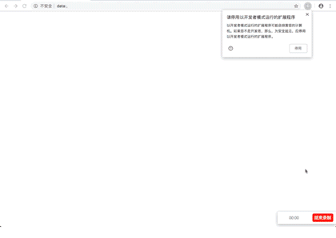
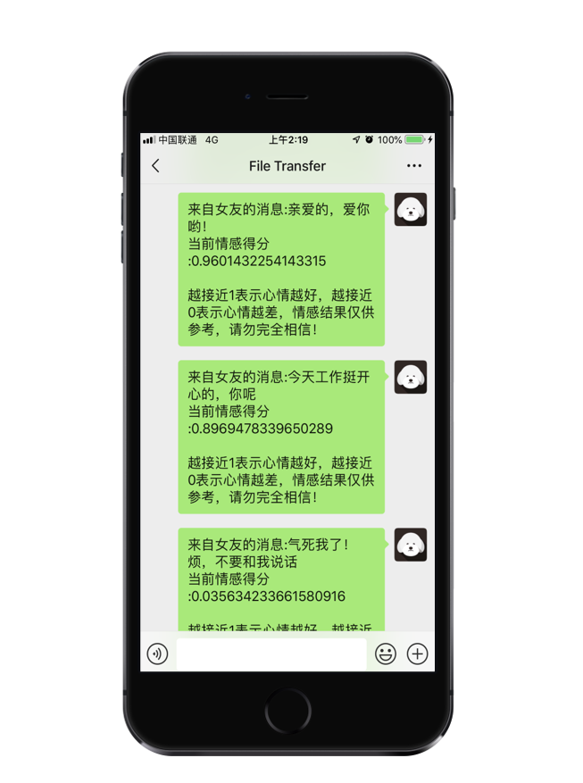
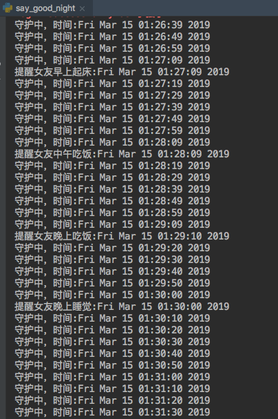
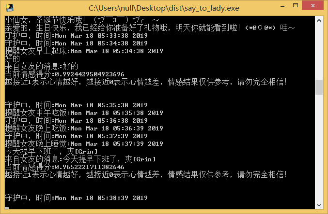

# <p align="center">一些非常有趣的python爬虫例子,对新手比较友好</p>


<p align="center">
    <a href="https://github.com/shengqiangzhang/examples-of-web-crawlers"></a>
    <a href="https://github.com/python/cpython"></a>
    <a href="https://opensource.org/licenses/mit-license.php"></a>
    <a href="https://github.com/shengqiangzhang/examples-of-web-crawlers/graphs/contributors"></a>
    <a href="https://github.com/shengqiangzhang/examples-of-web-crawlers/stargazers"></a>
    <a href="https://github.com/shengqiangzhang/examples-of-web-crawlers/network/members"></a>
    <a href="https://www.python.org/"></a>
</p>
<br />

## 项目简介
一些常见的网站爬虫例子，代码通用性较高，时效性较久。**项目代码对新手比较友好**，尽量用简单的python代码，并配有大量注释。


<br />
<br />

## 如何下载

没有或不懂如何设置代理的**中国用户**, 可跳转至镜像仓库[码云Gitee](https://gitee.com/shengqiangzhang/examples-of-web-crawlers)进行下载, 以便获得较快的下载速度。


<br />
<br />

## [1.淘宝模拟登录][taobao_login]
### 使用教程
1. [点击这里下载][1]下载chrome浏览器
2. 查看chrome浏览器的版本号，[点击这里下载][2]对应版本号的chromedriver驱动
3. pip安装下列包
    - [x] pip install selenium
4. [点击这里][3]登录微博，并通过微博绑定淘宝账号密码
5. 在main中填写chromedriver的绝对路径
6. 在main中填写微博账号密码

```python
#改成你的chromedriver的完整路径地址
chromedriver_path = "/Users/bird/Desktop/chromedriver.exe" 
#改成你的微博账号
weibo_username = "改成你的微博账号"
#改成你的微博密码
weibo_password = "改成你的微博密码"
```

### 演示图片


  


<br />
<br />

## [2.天猫商品数据爬虫][tmall_crawler]
### 使用教程
1. [点击这里下载][1]下载chrome浏览器
2. 查看chrome浏览器的版本号，[点击这里下载][2]对应版本号的chromedriver驱动
3. pip安装下列包
    - [x] pip install selenium
    - [x] pip install pyquery
4. [点击这里][3]登录微博，并通过微博绑定淘宝账号密码
5. 在main中填写chromedriver的绝对路径
6. 在main中填写微博账号密码

```python
#改成你的chromedriver的完整路径地址
chromedriver_path = "/Users/bird/Desktop/chromedriver.exe" 
#改成你的微博账号
weibo_username = "改成你的微博账号"
#改成你的微博密码
weibo_password = "改成你的微博密码"
```

### 演示图片
/example.gif)
/example2.png)


<br />
<br />

## [3.爬取淘宝我已购买的宝贝数据][taobao_buy_crawler]
### 使用教程
1. [点击这里下载][1]下载chrome浏览器
2. 查看chrome浏览器的版本号，[点击这里下载][2]对应版本号的chromedriver驱动
3. pip安装下列包
    - [x] pip install selenium
    - [x] pip install pyquery
4. [点击这里][3]登录微博，并通过微博绑定淘宝账号密码
5. 在main中填写chromedriver的绝对路径
6. 在main中填写微博账号密码

```python
#改成你的chromedriver的完整路径地址
chromedriver_path = "/Users/bird/Desktop/chromedriver.exe" 
#改成你的微博账号
weibo_username = "改成你的微博账号"
#改成你的微博密码
weibo_password = "改成你的微博密码"
```

### 演示图片
/example.gif)
/example2.png)


<br />
<br />

## [4.每天不同时间段通过微信发消息提醒女友][say_to_lady]
### 简介

有时候，你很想关心她，但是你太忙了，以至于她一直抱怨，觉得你不够关心她。你暗自下决心，下次一定要准时发消息给她，哪怕是几句话，可是你又忘记了。你觉得自己很委屈😭，但是她又觉得你不负责。

<br />

**现在，再不用担心了**，用python就可以给女友定时发提示消息了，**而且不会漏过每一个关键时刻**，每天**早上起床、中午吃饭、晚上吃饭、晚上睡觉**，都会准时发消息给她了，而且还可以让她**学习英语单词**哦！

<br />
在生日来临之时，自动发祝福语。在节日来临之时，比如**三八妇女节、女神节、情人节、春节、圣诞节**，自动发问候语哦，再也不用担心他说你没有仪式感了😀

<br />

最重要的时候，实时可以知道女友的**情感情绪指数**哦，再也不用担心女友莫名其妙生气了。


### 使用教程

1. pip安装下列包
- [x] pip install wxpy
- [x] pip install requests

2. 设置以下内容
- [x] 设置config.ini相关信息

### 演示图片






<br />
<br />

## [5.爬取5K分辨率超清唯美壁纸][crawler_5K_wallpaper]

### 简介

壁纸的选择其实很大程度上能看出电脑主人的内心世界，有的人喜欢风景，有的人喜欢星空，有的人喜欢美女，有的人喜欢动物。然而，终究有一天你已经产生审美疲劳了，但你下定决定要换壁纸的时候，又发现网上的壁纸要么分辨率低，要么带有水印。

<br />

这里有一款Mac下的小清新壁纸神器[Pap.er][8]，可能是Mac下最好的壁纸软件，**自带5K超清分辨率壁纸**，富有多种类型壁纸，当我们想在Windows或者Linux下使用的时候，就可以考虑将**5K超清分辨率壁纸**爬取下来。

### 功能截图


### 如何运行

```bash
# 跳转到当前目录
cd 目录名
# 先卸载依赖库
pip uninstall -y -r requirement.txt
# 再重新安装依赖库
pip install -r requirement.txt -i https://pypi.tuna.tsinghua.edu.cn/simple
# 开始运行
python main.py
```


<br />
<br />

## [6.爬取豆瓣排行榜电影数据(含GUI界面版)][getMovieInRankingList]

### 项目简介

这个项目源于大三某课程设计。平常经常需要搜索一些电影，但是不知道哪些评分高且评价人数多的电影。为了方便使用，就将原来的项目重新改写了。当做是对爬虫技术、可视化技术的实践了。主要是通过从排行榜和从影片关键词两种方式爬取电影数据。


### 功能截图

/example_rating.png)


## 如何运行

1. 打开Chrome浏览器，在网址栏输入chrome://version/查询当前Chrome版本
2. 打开[http://chromedriver.storage.googleapis.com/index.html][1]，下载对应版本的chromedriver驱动，**下载完成后务必解压**
3. 打开当前目录下的文件`getMovieInRankingList.py`，定位到第`107行`，将`executable_path=./chromedriver.exe`修改为你的chromedriver驱动路径
4. 执行命令`pip install -r requirement.txt`安装程序所需的依赖包
5. 执行命令`python main.py`运行程序


## 包含功能

- [x] 根据关键字搜索电影
- [x] 根据排行榜(TOP250)搜索电影
- [x] 显示IMDB评分及其他基本信息
- [x] 提供多个在线视频站点，无需vip
- [x] 提供多个云盘站点搜索该视频，以便保存到云盘
- [x] 提供多个站点下载该视频
- [ ] 等待更新


<br />
<br />

## [7.多线程+代理池爬取天天基金网、股票数据(无需使用爬虫框架)][fund_data]

### 简介
提到爬虫，大部分人都会想到使用Scrapy工具，但是仅仅停留在会使用的阶段。为了增加对爬虫机制的理解，我们可以手动实现多线程的爬虫过程，同时，引入IP代理池进行基本的反爬操作。

本次使用天天基金网进行爬虫，该网站具有反爬机制，同时数量足够大，多线程效果较为明显。

### 技术路线

- IP代理池
- 多线程
- 爬虫与反爬

### 数据格式
000056,建信消费升级混合,2019-03-26,1.7740,1.7914,0.98,2019-03-27 15:00

000031,华夏复兴混合,2019-03-26,1.5650,1.5709,0.38,2019-03-27 15:00

000048,华夏双债增强债券C,2019-03-26,1.2230,1.2236,0.05,2019-03-27 15:00

000008,嘉实中证500ETF联接A,2019-03-26,1.4417,1.4552,0.93,2019-03-27 15:00

000024,大摩双利增强债券A,2019-03-26,1.1670,1.1674,0.04,2019-03-27 15:00

000054,鹏华双债增利债券,2019-03-26,1.1697,1.1693,-0.03,2019-03-27 15:00

000016,华夏纯债债券C,2019-03-26,1.1790,1.1793,0.03,2019-03-27 15:00

### 功能截图


### 配置说明

```python
	# 确保安装以下库，如果没有，请在python3环境下执行pip install 模块名
	import requests
	import random
	import re
	import queue
	import threading
	import csv
	import json
```


<br />
<br />

## [8.一键生成微信个人专属数据报告(了解你的微信社交历史))][generate_wx_data]

### 简介

你是否想过生成一份属于你的微信个人数据报告，了解你的微信社交历史。现在，我们基于python对微信好友进行全方位数据分析，包括：昵称、性别、年龄、地区、备注名、个性签名、头像、群聊、公众号等。

其中，在分析好友类型方面，主要统计出你的陌生人、星标好友、不让他看我的朋友圈的好友、不看他的朋友圈的好友数据。在分析地区方面，主要统计所有好友在全国的分布以及对好友数最多的省份进行进一步分析。在其他方面，统计出你的好友性别比例、猜出你最亲密的好友，分析你的特殊好友，找出与你所在共同群聊数最多的好友数据，对你的好友个性签名进行分析，对你的好友头像进行分析，并进一步检测出使用真人头像的好友数据。

目前网上关于这方面的数据分析文章比较多，但是运行起来比较麻烦，**而本程序的运行十分简单，只需要扫码登录一步操作即可。**

### 功能截图

/example1.png)
/example2.png)
/example5.png)
/example6.png)
/example7.png)
/example8.png)
/example10.png)


### 如何运行
```bash
# 跳转到当前目录
cd 目录名
# 先卸载依赖库
pip uninstall -y -r requirement.txt
# 再重新安装依赖库
pip install -r requirement.txt
# 开始运行
python generate_wx_data.py
```

### 如何打包成二进制可执行文件
```bash
# 安装pyinstaller
pip install pyinstaller
# 跳转到当前目录
cd 目录名
# 先卸载依赖库
pip uninstall -y -r requirement.txt
# 再重新安装依赖库
pip install -r requirement.txt
# 更新 setuptools
pip install --upgrade setuptools
# 开始打包
pyinstaller generate_wx_data.py
```


## [9.一键生成QQ个人历史报告][generate_qq_data]


### 简介

近几年，由于微信的流行，大部分人不再频繁使用QQ，所以我们对于自己的QQ数据并不是特别了解。我相信，如果能够生成一份属于自己的QQ历史报告，那将是无比开心的一件事。


目前网上关于QQ的数据分析工具较少，原因是QQ相关接口比较复杂。**而本程序的运行十分简单，具有良好的用户交互界面，只需要扫码登录一步操作即可。**


目前本程序获取的数据包括：QQ详细数据、手机在线时间、非隐身状态下在线时间、QQ活跃时间、单向好友数量、QQ财产分析、群聊分析、过去一年我退出的群聊数据、退去一个月我删除的好友数据、所有代付信息、我最在意的人以及最在意我的人。**由于相关的数据接口有访问限制，所以本程序并没有对QQ好友进行分析。**


### 功能截图


### 如何运行
```bash
# 跳转到当前目录
cd 目录名
# 先卸载依赖库
pip uninstall -y -r requirement.txt
# 再重新安装依赖库
pip install -r requirement.txt
# 开始运行
python main.py
```


<br />
<br />


## [10.一键生成个人微信朋友圈数据电子书][generate_friend_group_data]


### 简介

微信朋友圈保留着你的数据，它留住了美好的回忆，记录了我们成长的点点滴滴。发朋友圈从某种意义上来讲是在记录生活，感受生活，并从中看到了每个人每一步的成长。

这么一份珍贵的记忆，何不将它保存下来呢？只需一杯咖啡的时间，即可一键打印你的朋友圈。它可以是纸质书，也可以是电子书，可以长久保存，比洗照片好，又有时间足迹记忆。

- 这本书，可以用来：
- 送给孩子的生日礼物
- 送给伴侣的生日礼物
- 送给未来的自己
- ……

现在，你可以选择打印电子书或者纸质书。打印纸质书的话，可以找第三方机构花钱购买；**打印电子书的话，我们完全可以自己动手生成，这可以省下一笔不小的开支**。


### 功能截图

在开始写代码思路之前，我们先看看最终生成的效果。

### 电子书效果(图片引用自[出书啦](https://chushu.la/))


### 纸质书效果(图片引用自[心书](https://weixinshu.com/library/unboxing))


### 如何运行
```bash
# 跳转到当前目录
cd 目录名
# 先卸载依赖库
pip uninstall -y -r requirement.txt
# 再重新安装依赖库
pip install -r requirement.txt
# 开始运行
python main.py
```


<br />
<br />


## [11.一键分析你的上网行为(web页面可视化)][chrome_history_data]


### 简介

**想看看你最近一年都在干嘛？看看你平时上网是在摸鱼还是认真工作？想写年度汇报总结，但是苦于没有数据？现在，它来了。**

这是一个能让你了解自己的浏览历史的Chrome浏览历史记录分析程序，**他适用于Chrome浏览器或者以Chromium为内核的浏览器。目前国内大部分浏览器均是以Chromium为内核的浏览器，所以基本上都可以使用。但是不支持以下浏览器：IE浏览器、Firefox浏览器、Safari浏览器。**

在该页面中你将可以查看有关自己在过去的时间里所访问浏览的域名、URL以及忙碌天数的前十排名以及相关的数据图表。


### 功能截图

在开始写代码思路之前，我们先看看最终生成的效果。

/demo.gif)


### 如何运行

在线演示程序:[http://39.106.118.77:8090](http://39.106.118.77:8090)(普通服务器，勿测压)

运行本程序十分简单，只需要按照以下命令即可运行：

```bash
# 跳转到当前目录
cd 目录名
# 先卸载依赖库
pip uninstall -y -r requirement.txt
# 再重新安装依赖库
pip install -r requirement.txt
# 开始运行
python app.py

# 运行成功后，通过浏览器打开http://localhost:8090
```


<br />
<br />


## [12.一键导出微信读书的书籍和笔记][weread]

> 本项目基于[@arry-lee](https://github.com/arry-lee)的项目[wereader](https://github.com/arry-lee/wereader/issues/20)修改而来，感谢原作者提供的源代码。

<br />

### 简介

全民阅读的时代已经来临，目前使用读书软件的用户数2.1亿，日活跃用户超过500万，其中19-35岁年轻用户占比超过60%，本科及以上学历用户占比高达80%，北上广深及其他省会城市/直辖市用户占比超过80%。**本人习惯使用微信读书，为了方便整理书籍和导出笔记，便开发了这个小工具。**


### 功能截图

在开始写代码思路之前，我们先看看最终生成的效果。


### 如何运行

```bash
# 跳转到当前目录
cd 目录名
# 先卸载依赖库
pip uninstall -y -r requirement.txt
# 再重新安装依赖库
pip install -r requirement.txt -i https://pypi.tuna.tsinghua.edu.cn/simple
# 开始运行
python pyqt_gui.py
```


<br />
<br />

## 补充

项目持续更新，欢迎您[star本项目][5]


<br />
<br />

## License
[The MIT License (MIT)][6]


[taobao_login]:https://github.com/shengqiangzhang/examples-of-web-crawlers/tree/master/1.%E6%B7%98%E5%AE%9D%E6%A8%A1%E6%8B%9F%E7%99%BB%E5%BD%95

[tmall_crawler]:https://github.com/shengqiangzhang/examples-of-web-crawlers/tree/master/2.%E5%A4%A9%E7%8C%AB%E5%95%86%E5%93%81%E6%95%B0%E6%8D%AE%E7%88%AC%E8%99%AB(%E5%B7%B2%E6%A8%A1%E6%8B%9F%E7%99%BB%E5%BD%95)

[taobao_buy_crawler]:https://github.com/shengqiangzhang/examples-of-web-crawlers/tree/master/3.%E6%B7%98%E5%AE%9D%E5%B7%B2%E4%B9%B0%E5%88%B0%E7%9A%84%E5%AE%9D%E8%B4%9D%E6%95%B0%E6%8D%AE%E7%88%AC%E8%99%AB(%E5%B7%B2%E6%A8%A1%E6%8B%9F%E7%99%BB%E5%BD%95)

[say_to_lady]:https://github.com/shengqiangzhang/examples-of-web-crawlers/tree/master/4.%E6%AF%8F%E5%A4%A9%E4%B8%8D%E5%90%8C%E6%97%B6%E9%97%B4%E6%AE%B5%E9%80%9A%E8%BF%87%E5%BE%AE%E4%BF%A1%E5%8F%91%E6%B6%88%E6%81%AF%E6%8F%90%E9%86%92%E5%A5%B3%E5%8F%8B

[crawler_5K_wallpaper]:https://github.com/shengqiangzhang/examples-of-web-crawlers/tree/master/5.%E7%88%AC%E5%8F%965K%E5%88%86%E8%BE%A8%E7%8E%87%E8%B6%85%E6%B8%85%E5%94%AF%E7%BE%8E%E5%A3%81%E7%BA%B8

[getMovieInRankingList]:https://github.com/shengqiangzhang/examples-of-web-crawlers/tree/master/6.%E7%88%AC%E5%8F%96%E8%B1%86%E7%93%A3%E6%8E%92%E8%A1%8C%E6%A6%9C%E7%94%B5%E5%BD%B1%E6%95%B0%E6%8D%AE(%E5%90%ABGUI%E7%95%8C%E9%9D%A2%E7%89%88)

[fund_data]:https://github.com/shengqiangzhang/examples-of-web-crawlers/tree/master/7.%E7%88%AC%E5%8F%96%E5%A4%A9%E5%A4%A9%E5%9F%BA%E9%87%91%E7%BD%91%E6%89%80%E6%9C%89%E5%9F%BA%E9%87%91%E6%95%B0%E6%8D%AE

[generate_wx_data]:https://github.com/shengqiangzhang/examples-of-web-crawlers/tree/master/8.%E4%B8%80%E9%94%AE%E7%94%9F%E6%88%90%E5%BE%AE%E4%BF%A1%E4%B8%AA%E4%BA%BA%E4%B8%93%E5%B1%9E%E6%95%B0%E6%8D%AE%E6%8A%A5%E5%91%8A(%E4%BA%86%E8%A7%A3%E4%BD%A0%E7%9A%84%E5%BE%AE%E4%BF%A1%E7%A4%BE%E4%BA%A4%E5%8E%86%E5%8F%B2)

[generate_qq_data]:https://github.com/shengqiangzhang/examples-of-web-crawlers/tree/master/9.%E4%B8%80%E9%94%AE%E7%94%9F%E6%88%90QQ%E4%B8%AA%E4%BA%BA%E5%8E%86%E5%8F%B2%E6%8A%A5%E5%91%8A

[generate_friend_group_data]:https://github.com/shengqiangzhang/examples-of-web-crawlers/tree/master/10.%E4%B8%80%E9%94%AE%E7%94%9F%E6%88%90%E4%B8%AA%E4%BA%BA%E5%BE%AE%E4%BF%A1%E6%9C%8B%E5%8F%8B%E5%9C%88%E6%95%B0%E6%8D%AE%E7%94%B5%E5%AD%90%E4%B9%A6

[chrome_history_data]:https://github.com/shengqiangzhang/examples-of-web-crawlers/tree/master/11.%E4%B8%80%E9%94%AE%E5%88%86%E6%9E%90%E4%BD%A0%E7%9A%84%E4%B8%8A%E7%BD%91%E8%A1%8C%E4%B8%BA(web%E9%A1%B5%E9%9D%A2%E5%8F%AF%E8%A7%86%E5%8C%96)

[weread]:https://github.com/shengqiangzhang/examples-of-web-crawlers/tree/master/12.%E4%B8%80%E9%94%AE%E5%AF%BC%E5%87%BA%E5%BE%AE%E4%BF%A1%E8%AF%BB%E4%B9%A6%E7%9A%84%E4%B9%A6%E7%B1%8D%E5%92%8C%E7%AC%94%E8%AE%B0


[1]:https://www.google.com/chrome/
[2]:http://chromedriver.storage.googleapis.com/index.html
[3]:https://account.weibo.com/set/bindsns/bindtaobao
[4]:https://raw.githubusercontent.com/shengqiangzhang/examples-of-web-crawlers/master/1.%E6%B7%98%E5%AE%9D%E6%A8%A1%E6%8B%9F%E7%99%BB%E5%BD%95/example.gif
[5]:https://github.com/shengqiangzhang/examples-of-web-crawlers
[6]:http://opensource.org/licenses/MIT
[7]:https://raw.githubusercontent.com/shengqiangzhang/examples-of-web-crawlers/master/3.%E6%B7%98%E5%AE%9D%E5%B7%B2%E4%B9%B0%E5%88%B0%E7%9A%84%E5%AE%9D%E8%B4%9D%E6%95%B0%E6%8D%AE%E7%88%AC%E8%99%AB(%E5%B7%B2%E6%A8%A1%E6%8B%9F%E7%99%BB%E5%BD%95)/example.gif
[8]:http://paper.meiyuan.in/
[9]:http://chromedriver.storage.googleapis.com/index.html
