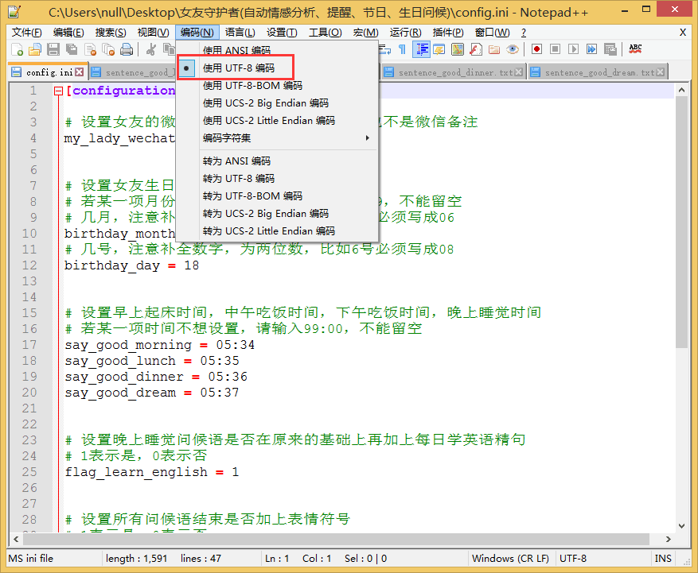

# <p align="center">一些python爬虫例子,对新手比较友好</p>


<p align="center">
    <a href="https://github.com/python/cpython"></a>
    <a href="https://github.com/shengqiangzhang/examples-of-web-crawlers"></a>
    <a href="https://opensource.org/licenses/mit-license.php"></a>
    <a href="https://github.com/shengqiangzhang/examples-of-web-crawlers/stargazers"></a>
    <a href="https://github.com/shengqiangzhang/examples-of-web-crawlers/network/members"></a>
</p>


## 简介
一些常见的网站爬虫例子，代码通用性较高，时效性较久。**项目代码对新手比较友好**，尽量用简单的python代码，并配有大量注释。


## [1.淘宝模拟登录][taobao_login]
### 使用教程
1. [点击这里下载][1]下载chrome浏览器
2. 查看chrome浏览器的版本号，[点击这里下载][2]对应版本号的chromedriver驱动
3. pip安装下列包
    - [x] pip install selenium
4. [点击这里][3]登录微博，并通过微博绑定淘宝账号密码
5. 在main中填写chromedriver的绝对路径
6. 在main中填写微博账号密码

```python
#改成你的chromedriver的完整路径地址
chromedriver_path = "/Users/bird/Desktop/chromedriver.exe" 
#改成你的微博账号
weibo_username = "改成你的微博账号"
#改成你的微博密码
weibo_password = "改成你的微博密码"
```

### 演示图片


  


## [2.天猫商品数据爬虫][tmall_crawler]
### 使用教程
1. [点击这里下载][1]下载chrome浏览器
2. 查看chrome浏览器的版本号，[点击这里下载][2]对应版本号的chromedriver驱动
3. pip安装下列包
    - [x] pip install selenium
    - [x] pip install pyquery
4. [点击这里][3]登录微博，并通过微博绑定淘宝账号密码
5. 在main中填写chromedriver的绝对路径
6. 在main中填写微博账号密码

```python
#改成你的chromedriver的完整路径地址
chromedriver_path = "/Users/bird/Desktop/chromedriver.exe" 
#改成你的微博账号
weibo_username = "改成你的微博账号"
#改成你的微博密码
weibo_password = "改成你的微博密码"
```

### 演示图片
/example.gif)
/example2.png)


## [3.爬取淘宝我已购买的宝贝数据][taobao_buy_crawler]
### 使用教程
1. [点击这里下载][1]下载chrome浏览器
2. 查看chrome浏览器的版本号，[点击这里下载][2]对应版本号的chromedriver驱动
3. pip安装下列包
    - [x] pip install selenium
    - [x] pip install pyquery
4. [点击这里][3]登录微博，并通过微博绑定淘宝账号密码
5. 在main中填写chromedriver的绝对路径
6. 在main中填写微博账号密码

```python
#改成你的chromedriver的完整路径地址
chromedriver_path = "/Users/bird/Desktop/chromedriver.exe" 
#改成你的微博账号
weibo_username = "改成你的微博账号"
#改成你的微博密码
weibo_password = "改成你的微博密码"
```

### 演示图片
/example.gif)
/example2.png)


## [4.每天不同时间段通过微信发消息提醒女友][say_to_lady]
### 简介

有时候，你很想关心她，但是你太忙了，以至于她一直抱怨，觉得你不够关心她。你暗自下决心，下次一定要准时发消息给她，哪怕是几句话，可是你又忘记了。你觉得自己很委屈😭，但是她又觉得你不负责。

<br />

**现在，再不用担心了**，用python就可以给女友定时发提示消息了，**而且不会漏过每一个关键时刻**，每天**早上起床、中午吃饭、晚上吃饭、晚上睡觉**，都会准时发消息给她了，而且还可以让她**学习英语单词**哦！

<br />
在生日来临之时，自动发祝福语。在节日来临之时，比如**三八妇女节、女神节、情人节、春节、圣诞节**，自动发问候语哦，再也不用担心他说你没有仪式感了😀

<br />

最重要的时候，实时可以知道女友的**情感情绪指数**哦，再也不用担心女友莫名其妙生气了。


### 使用教程

1. pip安装下列包
- [x] pip install wxpy
- [x] pip install requests
- 设置你的微信名字和她的微信名字

2. 设置以下内容
```python
[configuration]

# 设置女友的微信名称，记住，不是微信ID也不是微信备注
my_lady_wechat_name = 小强子


# 设置女友生日信息
# 若某一项月份或者日期不想设置，请输入99，不能留空
# 几月，注意补全数字，为两位数，比如6月必须写成06
birthday_month = 03
# 几号，注意补全数字，为两位数，比如6号必须写成08
birthday_day = 18


# 设置早上起床时间，中午吃饭时间，下午吃饭时间，晚上睡觉时间
# 若某一项时间不想设置，请输入99:00，不能留空
say_good_morning = 03:09
say_good_lunch = 03:10
say_good_dinner = 03:11
say_good_dream = 03:12


# 设置晚上睡觉问候语是否在原来的基础上再加上每日学英语精句
# 1表示是，0表示否
flag_learn_english = 1


# 设置所有问候语结束是否加上表情符号
# 1表示是，0表示否
flag_wx_emoj = 1


# 设置节日祝福语
# 情人节祝福语
str_Valentine = 亲爱的，情人节快乐！我想和你一起分享生命中的每一天，直到永远。

# 三八妇女节祝福语
str_Women = 嘿，女神节到了，祝我的女神开心快乐！你每天都是那么好看^_^

# 平安夜祝福语
str_Christmas_Eve = 宝贝，平安夜快乐，你吃苹果了吗？n(*≧▽≦*)n

# 圣诞节祝福语
str_Christmas = 小仙女，圣诞节快乐哦！（づ￣3￣）づ╭❤～

# 她生日的时候的祝福语
str_birthday = 亲爱的，生日快乐，我已经给你准备好了礼物哦，明天你就能看到啦！(*@ο@*) 哇～
```

### 演示图片





## [5.爬取5K分辨率超清唯美壁纸][crawler_5K_wallpaper]

### 简介

壁纸的选择其实很大程度上能看出电脑主人的内心世界，有的人喜欢风景，有的人喜欢星空，有的人喜欢美女，有的人喜欢动物。然而，终究有一天你已经产生审美疲劳了，但你下定决定要换壁纸的时候，又发现网上的壁纸要么分辨率低，要么带有水印。

<br />

<br />

这里有一款Mac下的小清新壁纸神器[Pap.er][8]，可能是Mac下最好的壁纸软件，**自带5K超清分辨率壁纸**，富有多种类型壁纸，当我们想在Windows或者Linux下使用的时候，就可以考虑将**5K超清分辨率壁纸**爬取下来。

### 使用教程

1. 确保以下库均已安装：

```python
# 如果没有安装，请使用pip install module安装
import requests
import filetype
import os
import json
from contextlib import closing
```

### 演示图片


## [6.爬取豆瓣排行榜电影数据(含GUI界面版)][getMovieInRankingList]

### 简介

这个项目源于大三某课程设计。平常经常需要搜索一些电影，但是不知道哪些评分高且评价人数多的电影。为了方便使用，就将原来的项目重新改写了。当做是对爬虫技术、可视化技术的实践了。主要是通过从排行榜和从影片关键词两种方式爬取电影数据。

### 使用教程

1. 打开[http://chromedriver.storage.googleapis.com/index.html][9]，根据自己的操作系统下载对应的chromedriver
2. 打开当前面目录下的**<u>getMovieInRankingList.py</u>**，定位到第59行，将`executable_path=/Users/bird/Desktop/chromedriver.exe`修改成你自己的chromedriver路径
3. 打开pycharm，依次安装以下包
- pip install Pillow
- pip install selenium

### 演示图片

/example_rating.png)
/example_keyword.png)

### 包含功能

- [x] 根据关键字搜索电影
- [x] 根据排行榜(TOP250)搜索电影
- [x] 显示IMDB评分及其他基本信息
- [x] 提供多个在线视频站点，无需vip
- [x] 提供多个云盘站点搜索该视频，以便保存到云盘
- [x] 提供多个站点下载该视频
- [ ] 等待更新


### 存在问题

目前没有加入反爬虫策略，如果运行出现403 forbidden提示，则说明暂时被禁止，解决方式如下：

- 加入cookies
- 采用随机延时方式
- 采用IP代理池方式(较不稳定)


## [7.多线程+代理池爬取天天基金网、股票数据(无需使用爬虫框架)][fund_data]

### 简介
提到爬虫，大部分人都会想到使用Scrapy工具，但是仅仅停留在会使用的阶段。为了增加对爬虫机制的理解，我们可以手动实现多线程的爬虫过程，同时，引入IP代理池进行基本的反爬操作。

本次使用天天基金网进行爬虫，该网站具有反爬机制，同时数量足够大，多线程效果较为明显。

### 技术路线

- IP代理池
- 多线程
- 爬虫与反爬

### 数据格式
000056,建信消费升级混合,2019-03-26,1.7740,1.7914,0.98,2019-03-27 15:00

000031,华夏复兴混合,2019-03-26,1.5650,1.5709,0.38,2019-03-27 15:00

000048,华夏双债增强债券C,2019-03-26,1.2230,1.2236,0.05,2019-03-27 15:00

000008,嘉实中证500ETF联接A,2019-03-26,1.4417,1.4552,0.93,2019-03-27 15:00

000024,大摩双利增强债券A,2019-03-26,1.1670,1.1674,0.04,2019-03-27 15:00

000054,鹏华双债增利债券,2019-03-26,1.1697,1.1693,-0.03,2019-03-27 15:00

000016,华夏纯债债券C,2019-03-26,1.1790,1.1793,0.03,2019-03-27 15:00

### 功能截图


### 配置说明

```python
	# 确保安装以下库，如果没有，请在python3环境下执行pip install 模块名
	import requests
	import random
	import re
	import queue
	import threading
	import csv
	import json
```


## 补充

项目持续更新，欢迎您[star本项目][5]


## License
[The MIT License (MIT)][6]


[taobao_login]:https://github.com/shengqiangzhang/examples-of-web-crawlers/tree/master/1.%E6%B7%98%E5%AE%9D%E6%A8%A1%E6%8B%9F%E7%99%BB%E5%BD%95

[tmall_crawler.py]:https://github.com/shengqiangzhang/examples-of-web-crawlers/tree/master/2.%E5%A4%A9%E7%8C%AB%E5%95%86%E5%93%81%E6%95%B0%E6%8D%AE%E7%88%AC%E8%99%AB(%E5%B7%B2%E6%A8%A1%E6%8B%9F%E7%99%BB%E5%BD%95)

[taobao_buy_crawler]:https://github.com/shengqiangzhang/examples-of-web-crawlers/tree/master/3.%E6%B7%98%E5%AE%9D%E5%B7%B2%E4%B9%B0%E5%88%B0%E7%9A%84%E5%AE%9D%E8%B4%9D%E6%95%B0%E6%8D%AE%E7%88%AC%E8%99%AB(%E5%B7%B2%E6%A8%A1%E6%8B%9F%E7%99%BB%E5%BD%95)

[say_to_lady]:https://github.com/shengqiangzhang/examples-of-web-crawlers/tree/master/4.%E6%AF%8F%E5%A4%A9%E4%B8%8D%E5%90%8C%E6%97%B6%E9%97%B4%E6%AE%B5%E9%80%9A%E8%BF%87%E5%BE%AE%E4%BF%A1%E5%8F%91%E6%B6%88%E6%81%AF%E6%8F%90%E9%86%92%E5%A5%B3%E5%8F%8B

[crawler_5K_wallpaper]:https://github.com/shengqiangzhang/examples-of-web-crawlers/tree/master/5.%E7%88%AC%E5%8F%965K%E5%88%86%E8%BE%A8%E7%8E%87%E8%B6%85%E6%B8%85%E5%94%AF%E7%BE%8E%E5%A3%81%E7%BA%B8

[getMovieInRankingList]:https://github.com/shengqiangzhang/examples-of-web-crawlers/tree/master/6.%E7%88%AC%E5%8F%96%E8%B1%86%E7%93%A3%E6%8E%92%E8%A1%8C%E6%A6%9C%E7%94%B5%E5%BD%B1%E6%95%B0%E6%8D%AE(%E5%90%ABGUI%E7%95%8C%E9%9D%A2%E7%89%88)

[fund_data]:https://github.com/shengqiangzhang/examples-of-web-crawlers/tree/master/7.%E7%88%AC%E5%8F%96%E5%A4%A9%E5%A4%A9%E5%9F%BA%E9%87%91%E7%BD%91%E6%89%80%E6%9C%89%E5%9F%BA%E9%87%91%E6%95%B0%E6%8D%AE

[1]:https://www.google.com/chrome/
[2]:http://chromedriver.storage.googleapis.com/index.html
[3]:https://account.weibo.com/set/bindsns/bindtaobao
[4]:https://raw.githubusercontent.com/shengqiangzhang/examples-of-web-crawlers/master/1.%E6%B7%98%E5%AE%9D%E6%A8%A1%E6%8B%9F%E7%99%BB%E5%BD%95/example.gif
[5]:https://github.com/shengqiangzhang/examples-of-web-crawlers
[6]:http://opensource.org/licenses/MIT
[7]:https://raw.githubusercontent.com/shengqiangzhang/examples-of-web-crawlers/master/3.%E6%B7%98%E5%AE%9D%E5%B7%B2%E4%B9%B0%E5%88%B0%E7%9A%84%E5%AE%9D%E8%B4%9D%E6%95%B0%E6%8D%AE%E7%88%AC%E8%99%AB(%E5%B7%B2%E6%A8%A1%E6%8B%9F%E7%99%BB%E5%BD%95)/example.gif
[8]:http://paper.meiyuan.in/
[9]:http://chromedriver.storage.googleapis.com/index.html
